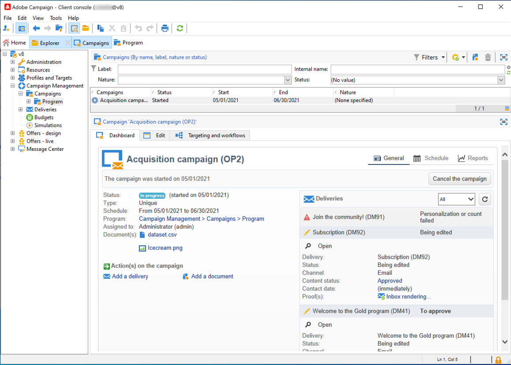

# 連線至Adobe Campaign v8{#gs-ac-connect}

Campaign用戶端主控台是一個豐富用戶端，可讓您連線至您的Campaign應用程式伺服器。

開始之前，您需要：

* 在 [相容性矩陣](compatibility-matrix.md)
* 取得您的Campaign伺服器URL
* 建立Adobe ID或從公司取得使用者認證

## 下載並安裝客戶端控制台

第一次使用Campaign時，或如果您需要升級至更新版本，則需要下載用戶端主控台並安裝。

有兩個選項可用：

1. 身為Campaign管理員，請連線至Adobe [Software Distribution](https://experience.adobe.com/#/downloads/content/software-distribution/en/campaign.html) 下載客戶端控制台安裝程式。 然後，您可以將其安裝在本機電腦上。

1. 身為一般使用者，Adobe可為您部署主控台：更新主控台後，系統會在快顯視窗中提示您下載最新的用戶端主控台版本。

>[!CAUTION]
>
>Adobe建議保留選項 **[!UICONTROL No longer ask this question]** 未選取，以確保在有新版本的Console可用時，會提醒所有使用者。  如果選取此選項，系統不會通知使用者新的可用版本。

## 建立連線

新安裝客戶端控制台後，請按照以下步驟建立與應用程式伺服器的連接：

1. 從Windows啟動Console **[!UICONTROL Start]** ，在 **Adobe Campaign** 方案組。

1. 按一下認證欄位右上角的連結，以存取連線設定視窗。

1. 按一下 **[!UICONTROL Add > Connection]** 並輸入Adobe Campaign應用程式伺服器的標籤和URL。

1. 透過URL指定與Adobe Campaign應用程式伺服器的連線。 使用電腦的DNS、別名或IP地址。

   例如，您可以使用 [`https://<machine>.<domain>.com`](https://myserver.adobe.com) 類型URL。

1. 核取選項 **[!UICONTROL Connect with an Adobe ID]**.

1. 按一下 **[!UICONTROL Ok]** 來儲存設定。

例如，您可以視需要新增連線，以連線至您的測試、預備和生產環境。

>[!NOTE]
>
>此 **[!UICONTROL Add]** 按鈕可讓您建立 **[!UICONTROL folders]** 來組織所有連線。 只需將每個連線拖放到資料夾中即可。

## 登入Adobe Campaign

若要登入現有執行個體，請遵循下列步驟：

1. 從Windows啟動Console **[!UICONTROL Start]** ，在 **Adobe Campaign** 方案組。

1. 按一下認證欄位右上角的連結，以存取連線設定視窗。

   

1. 選取您需要登入的Campaign執行個體。

1. 按一下&#x200B;**[!UICONTROL Ok]**。

1. 然後，您可以使用 [您的Adobe ID](#connect-ims).

   

## 授予使用者存取權

Adobe Campaign可讓您定義及管理指派給各種運算子的權限。 這些是授權或拒絕的一組權限和限制：

* 存取特定功能（透過具名權限）,
* 存取特定元素，
* 建立、修改和/或刪除元素（傳遞、聯絡人、促銷活動、群組等）。

進一步了解使用者，以及如何在 [本節](permissions.md).

身為Campaign管理員，您負責建立運算子，並與使用者共用其認證。

## 使用您的Adobe ID連線至Campaign{#connect-ims}

Campaign使用者使用其Adobe ID，透過AdobeIdentity Management系統(IMS)連線至Adobe Campaign主控台。 所有Adobe解決方案都可使用相同的ID。 將Adobe Campaign與其他解決方案搭配使用時，會儲存連線。

深入了解Adobe IMS，位於 [本頁](https://helpx.adobe.com/enterprise/using/identity.html).

## 網路存取{#web-access}

應用程式的某些部分可通過Web瀏覽器使用HTML用戶介面進行訪問：報告、傳送核准、執行個體監控等。

網路存取介面與主控台的介面類似，但是功能有所減少。

例如，對於指定運算子，促銷活動在主控台中會顯示下列選項：

而網路存取介面上，主要啟用檢視選項：

驗證程式中也會使用Web存取：運算子可以按一下核准請求電子郵件，並透過其網頁瀏覽器連線至Campaign，以驗證或拒絕傳送內容或預算。

若要從網路存取您的Campaign執行個體，URL為：  `https://<your adobe campaign server>:<port number>/view/home`.
