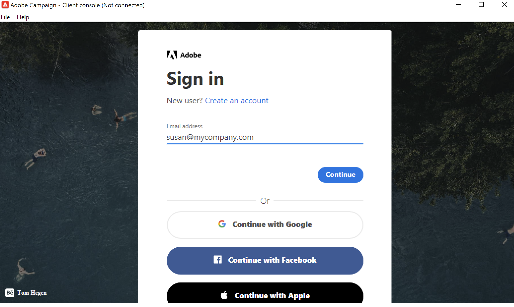

# 連接到Adobe Campaignv8{#gs-ac-connect}

要開始使用市場活動，必須安裝並配置客戶端控制台。

客戶端控制台是一個本機應用程式，它通過標準的Internet協定（如SOAP和HTTP）與Adobe Campaign應用程式伺服器通信。 市場活動客戶端控制台集中了所有功能和設定，並且由於它依賴本地快取而需要最小的頻寬。 為便於部署而設計的Campaign Client控制台可從Internet瀏覽器部署，並可自動更新，並且不需要任何特定的網路配置，因為它只生成HTTP(S)通信。

在開始之前，您需要：

* 檢查您的系統和工具與Adobe Campaign的相容性 [相容性矩陣](compatibility-matrix.md)
* 獲取您的市場活動伺服器URL
* 建立您的Adobe ID，或從您的公司獲取您的用戶憑據
* 在系統上安裝Microsoft Edge Webview2運行時。 [了解更多](#webview)

## 安裝客戶端控制台{#download-ac-console}

### Microsoft邊緣Webview2運行時 {#webview}

從Campaign Classic8.4生成版本，任何客戶端控制台安裝都需要安裝Microsoft邊緣Webview 2運行時。

預設情況下，Web視圖作為Windows 11作業系統的一部分安裝。 如果系統上尚未存在該功能，則市場活動客戶端控制台安裝程式將提示您從下載 [Microsoft開發商網站](http://www.adobe.com/go/acc-ms-webview2-runtime-download_tw){target="_blank"}。 請注意，下載連結在Internet Explorer 11瀏覽器上不工作，因為Microsoft已棄用其支援。 確保使用其他瀏覽器訪問連結。

### 下載控制台{#install-ac-console}

首次使用市場活動時，您需要下載客戶端控制台並安裝它。

下載客戶端控制台可使用以下兩個選項：

1. 作為市場活動管理員，連接到Adobe [軟體分發](https://experience.adobe.com/#/downloads/content/software-distribution/en/campaign.html){target="_blank"}。

1. 作為最終用戶，您的市場活動管理員為您部署客戶端控制台，並通過專用URL使其可用。

下載客戶端控制台安裝程式後，請將其安裝到本地電腦上。

請注意，安裝客戶端控制台語言後，您就無法更改該語言。

## 建立連接{#create-your-connection}

安裝客戶端控制台後，請按照以下步驟建立與應用程式伺服器的連接：

1. 啟動控制台並瀏覽右角的連結以訪問連接配置螢幕。

1. 按一下 **[!UICONTROL Add > Connection]** 並輸入Adobe Campaign應用伺服器的標籤和URL。

1. 通過URL指定到Adobe Campaign應用程式伺服器的連接。 使用DNS或電腦的別名或IP地址。

   例如，您可以使用 [`https://<machine>.<domain>.com`](https://myserver.adobe.com) 鍵。

1. 選中選項 **[!UICONTROL Connect with an Adobe ID]**。

1. 按一下 **[!UICONTROL Ok]** 的子菜單。

例如，您可以根據需要添加多個連接以連接到test、舞台和生產環境。

>[!NOTE]
>
>的 **[!UICONTROL Add]** 按鈕，您可以建立 **[!UICONTROL folders]** 來組織你的所有聯繫。 只需將每個連線拖放到資料夾中即可。

## 登錄Adobe Campaign {#logon-to-ac}

活動用戶通過AdobeIdentity Management系統(IMS)使用其Adobe ID連接到Adobe Campaign控制台。 他們可以使用相同的ID所有Adobe解決方案。 將Adobe Campaign與其他解決方案一起使用時，將保存連接。 瞭解有關Adobe IMS的詳細資訊 [此頁](https://helpx.adobe.com/enterprise/using/identity.html){target="_blank"}。

要登錄到實例，請執行以下步驟：

1. 啟動控制台並瀏覽右角的連結以訪問連接配置螢幕。

   

1. 選擇要登錄的市場活動實例。

1. 按一下&#x200B;**[!UICONTROL Ok]**。

然後，您可以使用您的Adobe ID登錄競選活動。

>[!NOTE]
>
>由於Microsoft邊緣Webview2不保存代理憑據，因此控制台可能會要求您在首次連接時進行兩次身份驗證。

## 升級客戶端控制台{#upgrade-ac-console}

將系統升級到較新的版本後，必須將客戶端控制台更新為同一版本。 這是最佳做法，對於某些版本，此升級是強制性的。 在這種情況下， [發行說明](release-notes.md)。

作為托管Cloud Services用戶，Adobe將為您部署客戶端控制台。 連接到升級的環境時，系統會提示您在彈出窗口中下載最新的客戶端控制台版本。 您必須接受此升級，並根據請求更新客戶端控制台。

>[!CAUTION]
>
>Adobe建議保留 **[!UICONTROL No longer ask this question]** 未選定，以確保在有新版本的控制台可用時收到警報。 如果選擇此選項，則不會通知用戶需要Console升級。

## 授予用戶訪問權限{#grant-access}

Adobe Campaign允許您定義和管理分配給各種運算子的權限。

作為市場活動管理員，您負責建立操作員並與用戶共用其憑據。

瞭解有關用戶的詳細資訊以及如何在 [此部分](gs-permissions.md)。

## 網路存取{#web-access}

使用HTML用戶介面，可以通過Web瀏覽器訪問應用程式的某些部分：報告、交付審批、實例監控等。

網路存取介面與主控台的介面類似，但是功能有所減少。

例如，對於給定操作員，市場活動將在控制台中顯示以下選項：

而網路存取介面上，主要啟用檢視選項：

Web訪問也用於驗證過程：操作員可以按一下批准請求電子郵件並通過其web瀏覽器連接到市場活動，以驗證或拒絕交付內容或預算。

要從Web訪問您的Campaign實例，URL為：  `https://<your adobe campaign server>:<port number>/view/home`。
