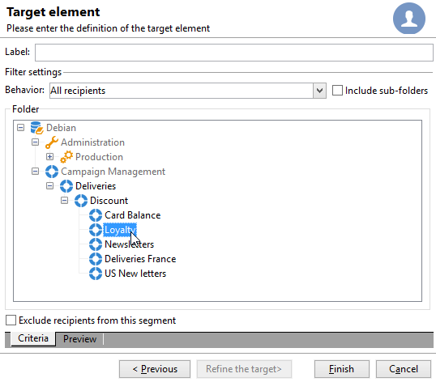
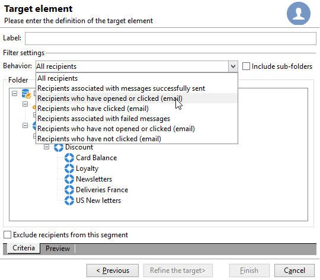

# 建立您的第一個傳遞 {#create-a-msg}

在本頁面，了解如何建立一次性傳遞。 您可以建立其他類型的傳遞，來建置您的使用案例。 在[本頁面](gs-message.md)進一步瞭解不同類型的傳遞以及建立方法。

建立一次性傳遞的關鍵步驟如下：

1. **建立新的傳遞**。 [閱讀更多](#create-the-delivery)

1. **定義傳遞內容**。 [閱讀更多](#content-of-the-delivery)

1. **選取目標群體**。 [閱讀更多](#target-population)

接著，您可以使用 Adobe Campaign 準備、測試、傳送及監視訊息。

>[!NOTE]
>
>本節所述的步驟假設所有目標收件者及其設定檔都儲存於資料庫，外部傳遞的情況除外。 請參閱[選取外部收件者](#selecting-external-recipients)。

## 建立傳遞 {#create-the-delivery}

若要建立傳遞，請依照以下步驟進行：

1. 瀏覽至傳遞清單，然後按一下 **[!UICONTROL Create]**。
1. 選取傳遞通道。 若要這麼做，請從下拉式清單中選擇適當的傳遞範本。

   

   為您安裝的每個通道提供內建範本：電子郵件、電話、行動通道 (推播/簡訊)、直接郵件、X (Twitter) 等。 清單中可用的通道取決於您的授權協議。

   您可以建立新的傳遞範本，以便預先設定特定參數來符合您的需求。  [了解更多](../send/create-templates.md)。

1. 在 **[!UICONTROL Label]** 欄位輸入傳遞的名稱。

   (選擇性) 傳遞程式碼也可指派至傳遞。傳遞名稱及其程式碼會顯示在傳遞清單之中，但不會向收件者公開。

1. (選擇性) 在 **[!UICONTROL Description]** 欄位新增說明。
1. (選擇性) 在相關欄位選取傳遞性質。此資訊對於傳遞追蹤很有用：您可以在傳遞清單根據此條件進行篩選，或使用此選擇條件建立查詢。
1. 按一下 **[!UICONTROL Continue]** 以顯示訊息內容視窗。

## 定義傳遞內容。 {#content-of-the-delivery}

傳遞內容已就緒，可進行設定。 每個通道都有專屬的傳遞內容定義。 如需詳細資訊，請參閱專用區段。

* [定義電子郵件內容](../send/email.md)
* [定義簡訊內容](../send/sms/sms-content.md)
* [定義直接郵件內容](../send/direct-mail.md)
* [定義推播通知內容](../send/push.md)

## 定義目標客群 {#target-population}

對於每個傳遞，您可以定義數種目標客群：

* **主要客群**：接收訊息的設定檔。 [了解更多](#select-the-main-target)
* **證明目標**：接收證明訊息的設定檔。 校樣是一種特定訊息，可讓您在將訊息傳送至主要目標之前先測試訊息。[了解更多](#select-the-proof-target)

此外，在行銷活動的內容之中，您可以新增：

* **種子地址**：不在傳遞目標但收到傳遞的收件者。 [了解更多](../audiences/test-profiles.md)
* **控制組**：未接收傳遞的群體，用於追蹤行為和行銷活動影響。 [了解更多](../../automation/campaigns/marketing-campaign-target.md#add-a-control-group)。

### 選取傳遞的主要收件者 {#select-the-main-target}

在大多數情況下，主要目標會從 Adobe Campaign 資料庫 (預設模式) 擷取。不過，收件者也可以儲存在[外部檔案](#selecting-external-recipients)之中。

若要選取傳遞的收件者，請遵循下列步驟：

1. 在傳遞編輯器之中，選取 **[!UICONTROL To]**。
1. 如果收件者儲存在資料庫，請選擇第一個選項。

   {zoomable="yes"}

1. 在 **[!UICONTROL Target mapping]** 下拉式清單選取[目標對應](../audiences/target-mappings.md) 。
1. 按一下 **[!UICONTROL Add]** 按鈕來定義限制篩選器。

   {width="60%" align="left" zoomable="yes"}

   選取篩選器類型並按一下 **[!UICONTROL Next]** 來定義條件。 您可以從 **[!UICONTROL Preview]** 索引標籤顯示篩選的收件者。 視目標型別而定，**[!UICONTROL Refine target]** 按鈕可讓您合併多個目標選擇標準。

   提供以下目標類型：

   * **[!UICONTROL Filtering conditions]**：使用此選項來定義查詢並顯示結果。 在[本章節](../../automation/workflow/query.md)瞭解如何設計查詢。
   * **[!UICONTROL A list of recipients]**：使用此選項來鎖定設定檔清單。 在[本章節](../audiences/create-audiences.md)深入了解有關清單的詳細資訊。
   * **[!UICONTROL A recipient]**：使用此選項來選取資料庫之中的特定設定檔。
   * **[!UICONTROL Recipients included in a folder]**：使用此選項來鎖定特定資料夾包含的所有設定檔。
   * **[!UICONTROL Recipients of a delivery]**：使用此選項從傳遞的收件者建立目標。 然後，您必須在清單之中選取傳遞：

     

   * **[!UICONTROL Delivery recipients belonging to a folder]**：使用此選項從包含於特定資料夾的收件者傳遞建立目標。

     

     您可以從下拉式清單選取，來篩選收件者的行為：

     

     >[!NOTE]
     >
     >**[!UICONTROL Include sub-folders]** 選項也可讓您鎖定於所選節點下方的樹狀結構資料夾所包含的傳遞。

   * **[!UICONTROL Subscribers of an information service]**：此選項可讓您選取收件者必須訂閱的電子報，才能成為正在建立的傳遞目標。

     

   * **[!UICONTROL User filters]**：此選項可讓您存取預先設定的篩選器，以使用這些篩選器作為資料庫設定檔的篩選標準。預先設定的篩選器會顯示在[此區段](../audiences/create-filters.md#default-filters)之中。
   * **[!UICONTROL Exclude recipients from this segment]** 選項可讓您鎖定不符合已定義目標條件的收件者。 若要使用此選項，請選取適當的方框，然後套用定位 (如先前所定義) 以排除產生的設定檔。

1. 在 **[!UICONTROL Label]** 欄位輸入此目標選擇的名稱。 依預設，該標籤是第一個鎖定目標標準的標籤。 結合篩選標準時，建議使用明確的名稱。
1. 按一下 **[!UICONTROL Finish]** 以驗證鎖定目標選項。

   主要目標設定索引標籤的中央區段會摘要說明已定義的鎖定目標標準。 按一下標準以檢視其內容 (設定和預覽)。 若要刪除標準，請按一下位於其標籤後面的十字形。

   

### 選取外部收件者 {#selecting-external-recipients}

您可以傳送訊息給未儲存在資料庫，但儲存在外部檔案的設定檔。例如，若要傳送傳遞內容給從文字檔案匯入的收件者，請遵循下列步驟：

1. 按一下 **[!UICONTROL To]** 連結以選取傳遞的收件者。
1. 選取 **[!UICONTROL Defined in an external file]** 選項。
1. 選取包含收件者的檔案。
1. 匯入收件者時，按一下 **[!UICONTROL File format definition...]** 連結以選取並設定外部檔案。

   如需資料匯入的詳細資訊，請參閱[Campaign Classic v7檔案](https://experienceleague.adobe.com/zh-hant/docs/campaign-classic/using/getting-started/importing-and-exporting-data/generic-imports-exports/executing-import-jobs#step-2---source-file-selection){target="_blank"}。

1. 按一下 **[!UICONTROL Finish]** 並將您的傳遞設定為標準傳遞。

>[!CAUTION]
>
>定義要傳送電子郵件給外部收件者的訊息內容時，請勿包含鏡像頁面的連結：此傳送模式無法產生該連結。

### 排除設定 {#define-exclusion-settings}

定義[傳遞的客群](#target-population)時，**[!UICONTROL Exclusions]** 索引標籤會用來限制訊息數量。 建議使用預設參數，但您可以根據需求調整設定。 不過，這些選項應僅由專家使用者變更，以避免任何誤用和錯誤。

>[!CAUTION]
>
>身為專家使用者，針對特定使用案例，您可以變更這些設定，但 Adobe 建議保留預設設定。

您可以排除已達到一定數量的連續錯誤或品質評等低於此視窗所指定臨界值的位址。 您也可以選擇是否授權未傳回任何資料的不合格位址。

若要修改預設設定，請按一下 **[!UICONTROL Edit...]** 連結。

+++ 檢視可用選項

* **[!UICONTROL Exclude duplicate addresses during delivery]**：此選項預設為使用狀態，並在傳遞期間移除重複的電子郵件地址。 套用的策略可能會因 Adobe Campaign 的使用方式及資料庫的資料類型而異。 可為每個傳遞範本設定選項的值。
* **[!UICONTROL Exclude recipients who no longer want to be contacted]** ，即電子郵件地址位於封鎖清單上的收件者 (「選擇退出」)。 為了遵守電子行銷的職業道德，必須保持選取此選項。
* **[!UICONTROL Exclude quarantined recipients]**：此選項可讓您從目標中排除任何包含已隔離地址的設定檔。 我們強烈建議維持選取此選項。 請參閱[本節](../send/quarantines.md)以深入瞭解更多有關隔離管理的資訊。
* **[!UICONTROL Limit delivery]** 至指定數目的訊息。 此選項可讓您輸入要傳送的訊息數目上限。 如果目標客群超過指示的訊息數，則會隨機選取套用至目標。 若要傳送所有訊息，請將此值保持為「0」。
* **[!UICONTROL Keep duplicate records (same identifier)]**：此選項允許傳送多個傳遞給符合多個目標選擇標準的收件者。
+++

### 選取校樣訊息的收件者 {#select-the-proof-target}

針對電子郵件傳遞，您可以傳送校樣以驗證訊息內容。 傳送校樣可讓您檢查選擇退出連結、鏡像頁面和任何其他連結、驗證訊息、驗證影像是否顯示、偵測可能的錯誤等。 您可能也會想要在不同裝置檢查您的設計和轉譯。

校樣是一種特定訊息，可讓您在將訊息傳送至主要客群之前先測試訊息。校樣的收件者負責核准訊息：轉譯、內容、個人化設定、設定。

有關校樣收件者與傳送的詳細資訊，請參閱讀[本章節](../send/preview-and-proof.md#send-proofs)。

#### 教學課程影片 {#seeds-and-proofs-video}

您可以在本影片瞭解如何向現有電子郵件新增種子和校樣，以及如何傳送。

>[!VIDEO](https://video.tv.adobe.com/v/3447010?quality=12&captions=chi_hant)

其他 Campaign Classic 作法影片可在[此處](https://experienceleague.adobe.com/docs/campaign-classic-learn/tutorials/overview.html?lang=zh-Hant)取得。

## 準備並驗證您的傳遞 {#validate-the-delivery}

建立並設定傳遞後，您必須先驗證傳遞內容，才能將其傳送至主要目標。

操作步驟：

1. **分析傳遞**：此步驟可讓您準備要傳遞的訊息。 [了解更多](../send/delivery-analysis.md)。

1. **傳送校樣**：此步驟可讓您控制內容、URL、個人化等。 [了解更多](../send/preview-and-proof.md)。

>[!IMPORTANT]
>
>每次修改訊息內容後，必須執行上述&#x200B;**兩個步驟**。

## 設定並傳送傳遞 {#configuring-and-sending-the-delivery}

存取傳遞參數以設定更多設定，並定義如何傳送訊息。 您可以定義傳遞優先順序、設定傳送波段、設定重試設定，以及測試您的傳遞傳送。 完成此設定之後，您可以確認傳送。然後會立即傳送訊息，或根據傳遞排程傳送訊息。

在[本頁](../send/configure-and-send.md)了解如何設定您的傳遞設定。
