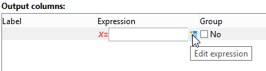

# 查詢行銷活動資料庫

透過使用所選資料表的欄位或公式可以建立查詢。

在Adobe Campaign中建立查詢的步驟如下：

1. 選取工作表。 請參考[步驟1 — 選擇資料表](#step-1---choose-a-table)。
1. 選取要擷取的資料。 請參閱[步驟2 — 選擇要擷取的資料](#step-2---choose-data-to-extract)。
1. 定義資料排序順序。 請參考[步驟3 — 排序資料](#step-3---sort-data)。
1. 篩選資料。 請參閱[步驟4 — 篩選資料](#step-4---filter-data)。
1. 格式化資料。 請參閱[步驟5 — 格式化資料](#step-5---format-data)。
1. 顯示結果。 請參閱[步驟6 — 預覽資料](#step-6---preview-data)。

>[!NOTE]
>
>* 所有這些步驟都可在[一般查詢編輯器](query-editor.md)中使用。 在另一個前後關聯中建立查詢時，可能會忽略某些步驟。
>
>* 若要進一步瞭解查詢以及如何建立查詢，請參閱[Campaign工作流程檔案](../../automation/workflow/query.md)。

若要查詢Campaign資料庫，請開啟&#x200B;**[一般查詢編輯器](query-editor.md)**，然後執行下列步驟：

## 步驟1 — 選擇表格 {#step-1---choose-a-table}

選取包含您要在&#x200B;**[!UICONTROL Document type]**&#x200B;視窗中查詢之資料的資料表。 如有需要，請使用篩選欄位或&#x200B;**[!UICONTROL Filters]**&#x200B;按鈕來篩選資料。

## 步驟2 — 選擇要擷取的資料 {#step-2---choose-data-to-extract}

在&#x200B;**[!UICONTROL Data to extract]**&#x200B;視窗中，選取要顯示的資料：這些欄位將構成輸出欄。

例如，選取&#x200B;**[!UICONTROL Age]**、**[!UICONTROL Primary key]**、**[!UICONTROL Email domain]**&#x200B;和&#x200B;**[!UICONTROL City]**。 結果會根據此選取專案進行組織。 使用視窗右側的藍色箭頭來變更欄順序。

您可以將公式插入運算式中，或對彙總函式執行程式，以編輯運算式。 若要這麼做，請按一下&#x200B;**[!UICONTROL Expression]**&#x200B;欄位，然後選取&#x200B;**[!UICONTROL Edit expression]**。

您可以將輸出資料行資料分組：若要這麼做，請檢查&#x200B;**[!UICONTROL Yes]**&#x200B;視窗之&#x200B;**[!UICONTROL Group]**&#x200B;資料行中的&#x200B;**[!UICONTROL Data to extract]**。 此函式產生關於核取之群組軸的結果。 [此區段](../../automation/workflow/query-delivery-info.md)中有群組查詢的範例。

* **[!UICONTROL Handle groupings (GROUP BY + HAVING)]**&#x200B;函式可讓您「分組依據」並選取已分組的專案（「具有」）。 此函式適用於輸出欄中的所有欄位。 例如，此選項可讓您將輸出欄的所有選擇分組，並復原特定型別的資訊，例如介於35到50之間的收件者。

  如需詳細資訊，請參閱[本章節](../../automation/workflow/query-grouping-management.md)。

* **[!UICONTROL Remove duplicate rows (DISTINCT)]**&#x200B;函式可讓您去除重複輸出資料行中取得的相同結果。 例如，如果您選取輸出欄中的「姓氏」、「名字」和「電子郵件」欄位來進行人口普查，資料相同的欄位將會被刪除，因為這意味著資料庫中已經多次輸入相同的連絡人：只會考慮一個結果。

## 步驟3 — 排序資料 {#step-3---sort-data}

**[!UICONTROL Sorting]**&#x200B;視窗可讓您排序欄內容。 使用箭頭來變更欄順序：

* **[!UICONTROL Sorting]**&#x200B;欄可啟用簡單排序，並從A到Z或依遞增順序排列欄內容。
* **[!UICONTROL Descending sort]**&#x200B;會以遞減順序將內容從Z排列到A。 這對於檢視紀錄銷售非常有用，例如：最高數字會顯示在清單頂端。

在此範例中，資料會根據收件者年齡以遞增順序排序。

## 步驟4 — 篩選資料 {#step-4---filter-data}

查詢編輯器可讓您篩選資料以縮小搜尋範圍。

提供的篩選器取決於查詢涉及的表格。

選取&#x200B;**[!UICONTROL Filtering conditions]**&#x200B;後，您將會存取&#x200B;**[!UICONTROL Target elements]**&#x200B;區段：這可讓您定義如何篩選要收集的資料。

* 若要建立新的篩選器，請選取建立要驗證的公式所需的欄位、運運算元和值，以便選取資料。 您也可以在此頁面[上結合數個條件做為詳細的](filter-conditions.md)。
* 若要使用先前儲存的篩選器，請按一下&#x200B;**[!UICONTROL Add]**&#x200B;按鈕以開啟下拉式清單，按一下&#x200B;**[!UICONTROL Predefined filter]**&#x200B;並選取您想要的篩選器。

  

* 在&#x200B;**[!UICONTROL Generic query editor]**&#x200B;中建立的篩選器可用於其他查詢應用程式，反之亦然。 若要儲存篩選器，請按一下&#x200B;**[!UICONTROL Save]**&#x200B;圖示。

  >[!NOTE]
  >
  >如需建立和使用篩選的詳細資訊，請參閱[篩選選項](filter-conditions.md)。

如下列範例所示，若要復原所有說英語的收件者，請選取：「收件者語言&#x200B;**等於** EN」。

>[!NOTE]
>
>您可以在&#x200B;**值**&#x200B;欄位中輸入下列公式，直接存取選項： **$（選項:OPTION_NAME）**。

按一下&#x200B;**[!UICONTROL Preview]**&#x200B;標籤以檢視篩選條件的結果。 在此情況下，所有說英語的收件者都會顯示其名稱、名字和電子郵件地址。

熟悉SQL語言的使用者可以按一下&#x200B;**[!UICONTROL Generate SQL query]**&#x200B;以檢視SQL中的查詢。

## 步驟5 — 格式化資料 {#step-5---format-data}

設定限制篩選器後，即可存取&#x200B;**[!UICONTROL Data formatting]**&#x200B;視窗。 此視窗可讓您重新排列輸出欄、轉換資料，以及變更欄標籤的大寫/小寫。 它也可讓您使用計算欄位將公式套用至最終結果。

>[!NOTE]
>
>如需有關計算欄位型別的詳細資訊，請參閱[建立計算欄位](filter-conditions.md#creating-calculated-fields)。

未勾選的欄不會顯示在資料預覽視窗中。

**[!UICONTROL Transformation]**&#x200B;欄可讓您將欄標籤變更為大寫或小寫。 選取欄並按一下&#x200B;**[!UICONTROL Transformation]**&#x200B;欄。 您可以選擇：

* **[!UICONTROL Switch to lower case]**,
* **[!UICONTROL Switch to upper case]**,
* **[!UICONTROL First letter in upper case]**。

## 步驟6 — 預覽資料 {#step-6---preview-data}

**[!UICONTROL Data preview]**&#x200B;視窗是最後一個階段。 按一下&#x200B;**[!UICONTROL Start the preview of the data]**&#x200B;以取得您的查詢結果。 它以欄或XML格式提供。 按一下&#x200B;**[!UICONTROL Generated SQL queries]**&#x200B;索引標籤以檢視SQL格式的查詢。

在此範例中，資料會根據收件者年齡以遞增順序排序。

>[!NOTE]
>
>根據預設，**[!UICONTROL Data preview]**&#x200B;視窗中只會顯示前200行。 若要變更，請在&#x200B;**[!UICONTROL Lines to display]**&#x200B;方塊中輸入數字，然後按一下&#x200B;**[!UICONTROL Start the preview of the data]**。

**相關主題**

* [工作流程查詢活動](../../automation/workflow/query.md)
* [查詢收件者表格](../../automation/workflow/querying-recipient-table.md)
* [篩選條件](filter-conditions.md)