# 定義篩選條件{#filter-conditions}

To design your query, you must select the filtering conditions in the query editor. Available capabilities and use cases are detailed in this page.

## Choose the operator {#choose-operator}

Within filtering conditions, you need to link two values together using an operator.

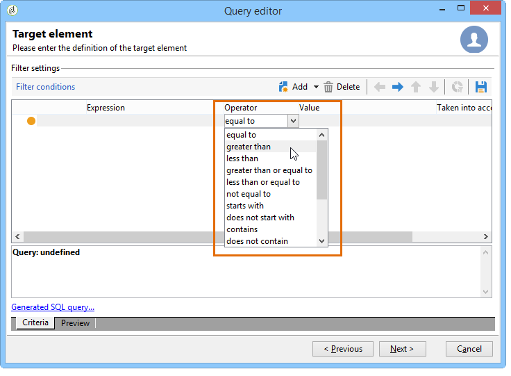

Below is a list of the operators available:

<table> 
 <thead> 
  <tr> 
   <th> 運算元  </th> 
   <th> </th> 
   <th> 範例   </th> 
  </tr> 
 </thead> 
 <tbody> 
  <tr> 
   <td> Equal to   </td> 
   <td> </td> 
   <td><strong></strong> </td> 
  </tr> 
  <tr> 
   <td> Greater than   </td> 
   <td> </td> 
   <td><strong></strong> </td> 
  </tr> 
  <tr> 
   <td> Less than   </td> 
   <td> </td> 
   <td><strong></strong> </td> 
  </tr> 
  <tr> 
   <td> Greater than or equal to   </td> 
   <td> </td> 
   <td><strong></strong> </td> 
  </tr> 
  <tr> 
   <td> Less than or equal to   </td> 
   <td> </td> 
   <td><strong></strong> </td> 
  </tr> 
  <tr> 
   <td> </td> 
   <td> </td> 
   <td><strong></strong> </td> 
  </tr> 
  <tr> 
   <td> </td> 
   <td> </td> 
   <td><strong></strong> </td> 
  </tr> 
  <tr> 
   <td> </td> 
   <td> </td> 
   <td><strong></strong> </td> 
  </tr> 
  <tr> 
   <td> Contains   </td> 
   <td> </td> 
   <td><strong></strong> </td> 
  </tr> 
  <tr> 
   <td> </td> 
   <td> </td> 
   <td><strong></strong> </td> 
  </tr> 
  <tr> 
   <td> Like   </td> 
   <td> Like 與　Contains　運算子非常類似。  </td> 
   <td><strong></strong> </td> 
  </tr> 
  <tr> 
   <td> Not like   </td> 
   <td>在這裡，輸入的值也必須包含 % 萬用字元。  </td> 
   <td><strong></strong> </td> 
  </tr> 
  <tr> 
   <td> Is empty   </td> 
   <td> </td> 
   <td><strong></strong> </td> 
  </tr> 
  <tr> 
   <td> </td> 
   <td> </td> 
   <td><strong></strong> </td> 
  </tr> 
  <tr> 
   <td> </td> 
   <td> </td> 
   <td><strong></strong> </td> 
  </tr> 
  <tr> 
   <td> </td> 
   <td> </td> 
   <td><strong></strong> </td> 
  </tr> 
 </tbody> 
</table>

## Use AND, OR, EXCEPT {#using-and--or--except}

For queries using several filtering conditions, you need to define links between the conditions. There are three possible links:

* **[!UICONTROL And]**
* **[!UICONTROL Or]**
* **[!UICONTROL Except]**

**[!UICONTROL And]**

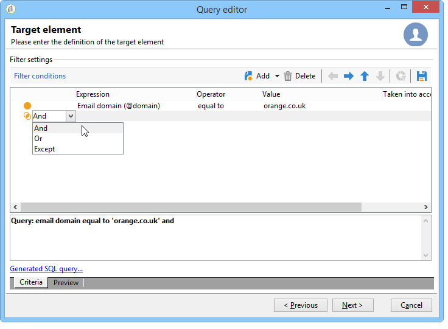

* **[!UICONTROL And]**
* **[!UICONTROL Or]**

  The following example lets you find recipients whose email domain contains &quot;orange.co.uk&quot; OR whose post code starts with &quot;NW&quot;.

  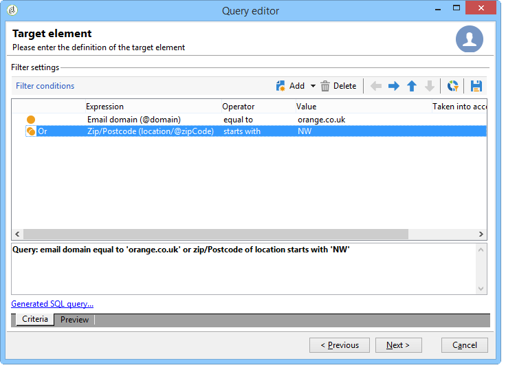

* **[!UICONTROL Except]**

  In the following example, we want to return recipients whose email domain contains &quot;orange.co.uk&quot; EXCEPT if the recipient&#39;s last name is &quot;Smith&quot;.

  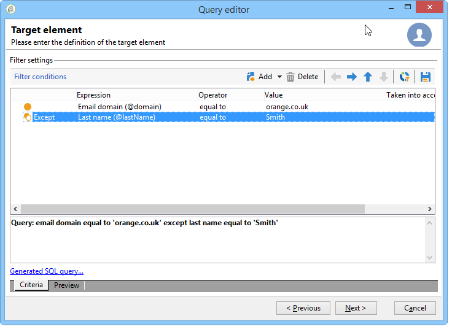

This example shows a filter which lets you display: recipients who either speak Spanish, OR are women with mobile numbers, OR recipients without an account number and whose company name starts with the letter &quot;N&quot;.

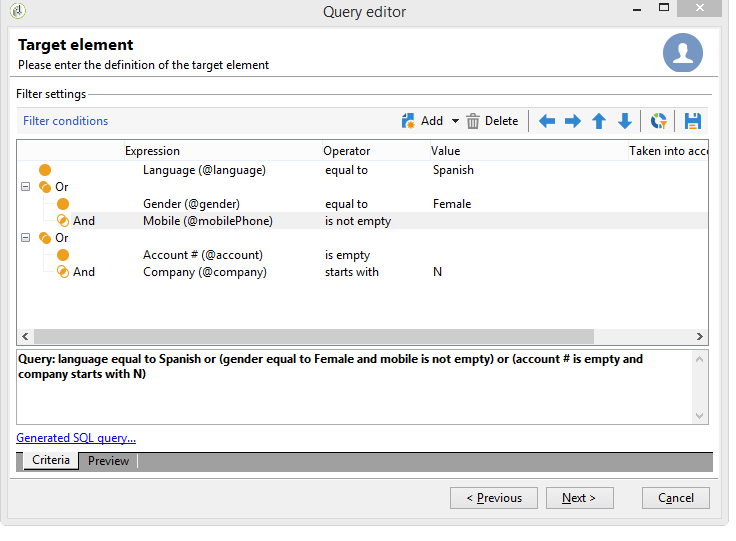

## Prioritize conditions {#prioritizing-conditions}

This section explains how to prioritize conditions thanks to the blue arrows in the toolbar.

* The arrow pointing to the right lets you add a level of parentheses to the filter.
* The arrow pointing to the left lets you delete a selected parenthesis level from the filter.

  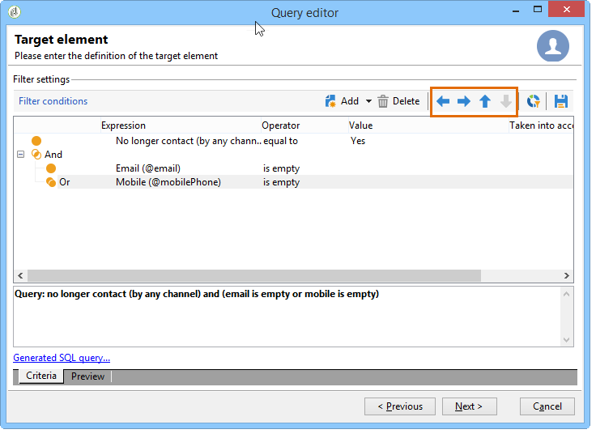

* The vertical arrows let you move a condition, thereby changing their execution sequence.

**[!UICONTROL City equal to London OR gender equal to male and mobile not indicated OR account # starts with "95" and company name starts with "A"]**

**[!UICONTROL Gender (@gender) equal to Male]****[!UICONTROL Remove a parenthesis level]**

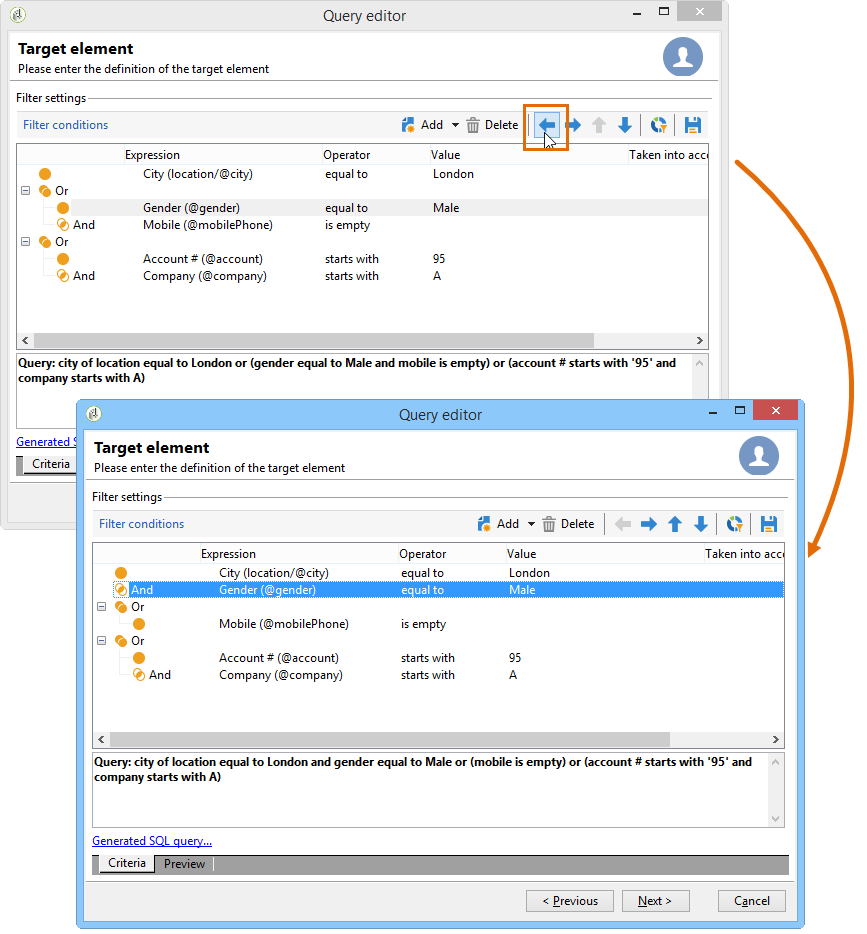

**[!UICONTROL Gender (@gender) equal to Male]****[!UICONTROL And]**

## Select data to extract {#selecting-data-to-extract}

**[!UICONTROL Main element]**

**[!UICONTROL Email domain]****[!UICONTROL Calculated SQL field]****[!UICONTROL (@domain)]**

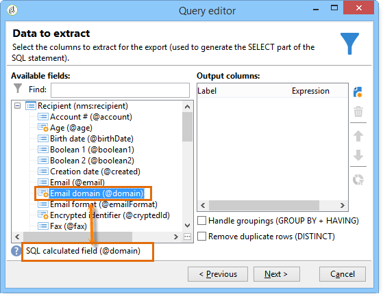

>[!NOTE]
>
>**[!UICONTROL Search]**

**[!UICONTROL Data preview]**

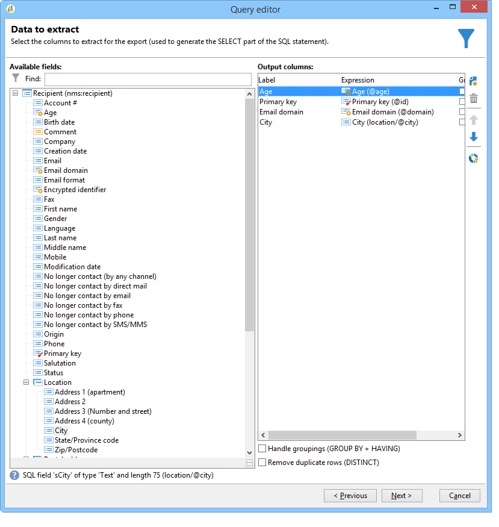

**[!UICONTROL Display advanced fields]**

******[!UICONTROL Boolean 2]****[!UICONTROL Boolean 3]****[!UICONTROL Foreign key of "Folder" link]**

The following example shows the advanced fields of the recipient table.

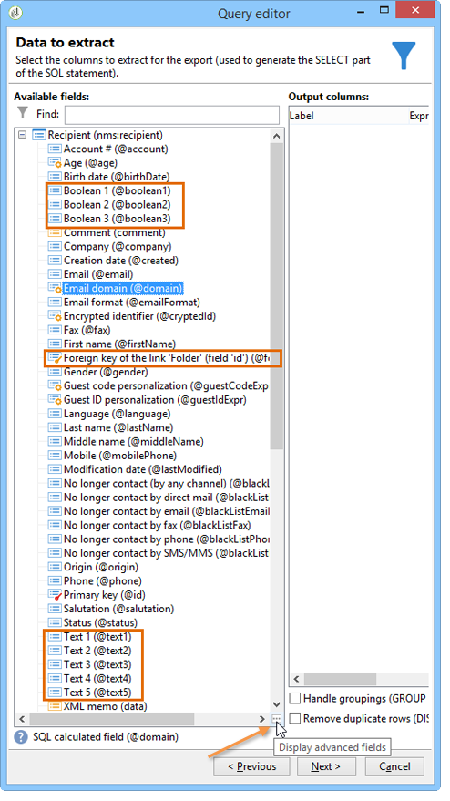

The various categories of fields:

<table> 
 <thead> 
  <tr> 
   <th> 圖示  </th> 
   <th> 說明  </th> 
   <th> </th> 
  </tr> 
 </thead> 
 <tbody> 
  <tr> 
   <td>  </td> 
   <td> </td> 
   <td> </td> 
  </tr> 
  <tr> 
   <td>  </td> 
   <td> 主索引鍵。 此SQL欄位是識別資料表中記錄的方法。  </td> 
   <td> 識別碼收件者是主要金鑰，而且依定義識別碼是唯一的。  </td> 
  </tr> 
  <tr> 
   <td>  </td> 
   <td> 外部索引鍵。 用作其他資料表的連結。  </td> 
   <td> 收件者外部金鑰、服務外部金鑰等  </td> 
  </tr> 
  <tr> 
   <td> 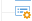 </td> 
   <td> 計算欄位。 此型別的欄位是根據要求使用資料庫中的值計算的。  </td> 
   <td> 年齡、電子郵件網域等  </td> 
  </tr> 
  <tr> 
   <td>  </td> 
   <td> 包含長文字的欄位。  </td> 
   <td> 註解、完整地址等  </td> 
  </tr> 
  <tr> 
   <td>  </td> 
   <td> 已編制索引的SQL欄位。  </td> 
   <td> 全名、ISO代碼等。  </td> 
  </tr> 
 </tbody> 
</table>

表格與收集要素的連結：

<table> 
 <thead> 
  <tr> 
   <th> 圖示  </th> 
   <th> 說明  </th> 
   <th> 範例   </th> 
  </tr> 
 </thead> 
 <tbody> 
  <tr> 
   <td> 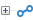 </td> 
   <td> 尤其是表格的連結。 這些與1-1型別關聯一致。 來源表格的某個專案只能與目標表格的某個專案一致。 例如，僅有一個收件者可連結至國家/地區。  </td> 
   <td> 資料夾、州、國家/地區等。  </td> 
  </tr> 
  <tr> 
   <td>  </td> 
   <td> 特定表格的收集要素。 這些與1-N型別關聯一致。 一個來源表格出現次數可以與目標表格的多個出現次數一致，但目標表格出現次數可以只與目標表格出現次數一致。 例如，一位收件者可以訂閱'n'個訂閱字母。  </td> 
   <td> 訂閱、清單、排除記錄檔等  </td> 
  </tr> 
 </tbody> 
</table>

>[!NOTE]
>
>* 使用&#x200B;**[!UICONTROL Add]**&#x200B;按鈕（在側邊圖示列上方）新增要編輯運算式的輸出資料行。 
>* ****
>* Change the order of the output columns using the arrows.
>* **[!UICONTROL Distribution of values]**

## Create calculated fields {#creating-calculated-fields}

按一下 **[!UICONTROL Add a calculated field]**。

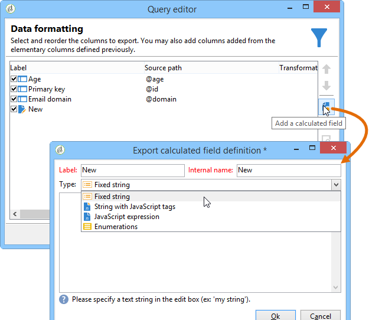

有四種類型的計算欄位：

* **[!UICONTROL Fixed string]**

  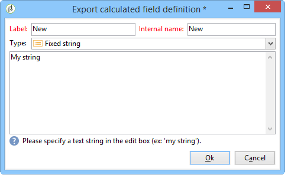

* **[!UICONTROL String with JavaScript tags]**

  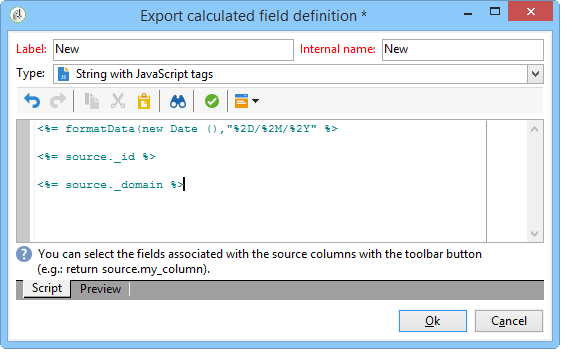

* **[!UICONTROL JavaScript expression]**

  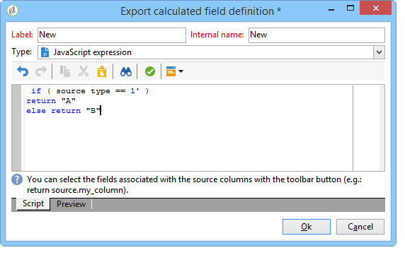

* **[!UICONTROL Enumerations]**

  It&#39;s possible to use the source value of a column and give it a destination value. This destination value will be displayed in the new output column.

  **[!UICONTROL Enumerations]**

  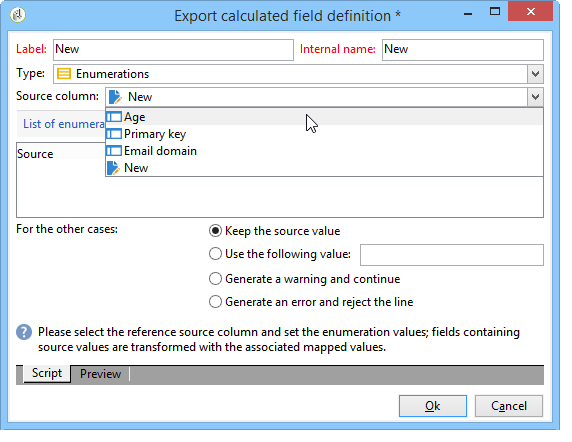

  **[!UICONTROL Enumerations]**

   * **[!UICONTROL Keep the source value]**
   * **[!UICONTROL Use the following value]**
   * **[!UICONTROL Generate a warning and continue]**
   * **[!UICONTROL Generate an error and reject the line]**

**[!UICONTROL Detail of calculated field]**

**[!UICONTROL Remove the calculated field]**

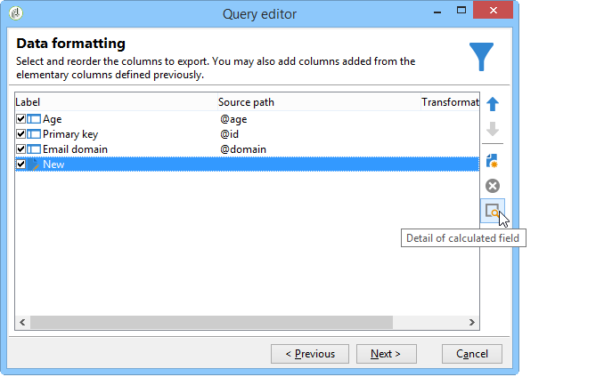

## Build expressions {#building-expressions}

The expression editing tool lets you calculate aggregates, generate function, or edit a formula using an expression.

The following example shows you how to run a count on a primary key.

應用以下步驟：

1. **[!UICONTROL Add]****[!UICONTROL Data to extract]****[!UICONTROL Formula type]**

   **[!UICONTROL Field only]****[!UICONTROL Aggregate]****[!UICONTROL Expression]**

   **[!UICONTROL Process on an aggregate function]****[!UICONTROL Count]**&#x200B;按一下 **[!UICONTROL Next]**。

   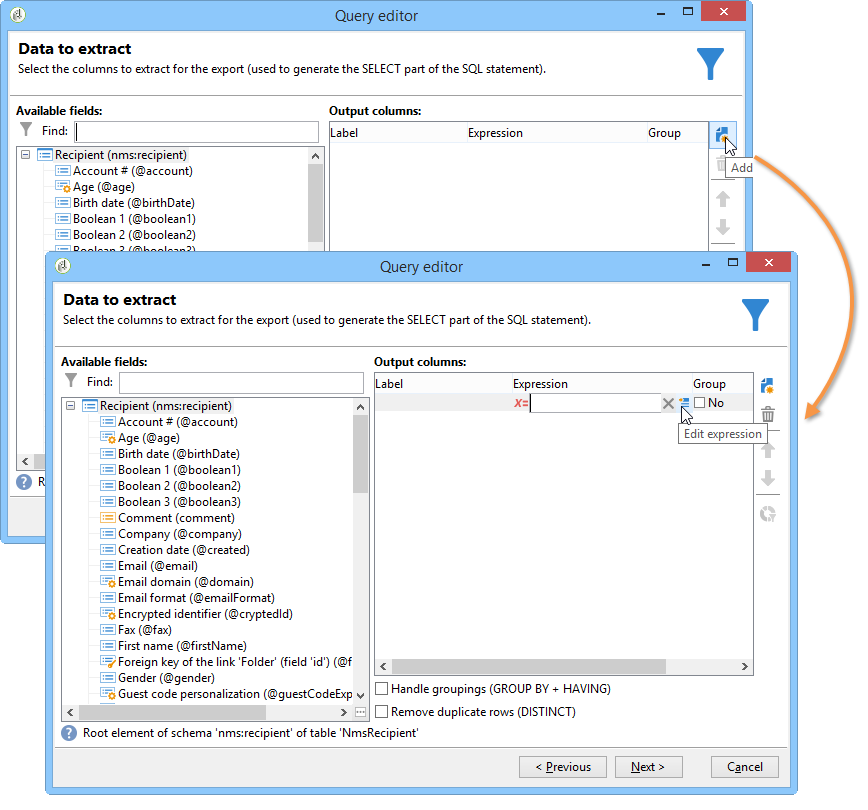

1. The primary key is calculated.

   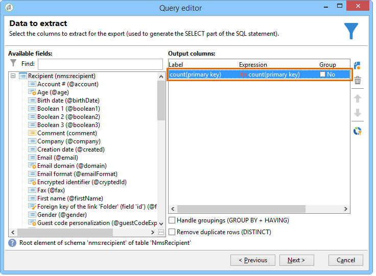

**[!UICONTROL Formula types]**

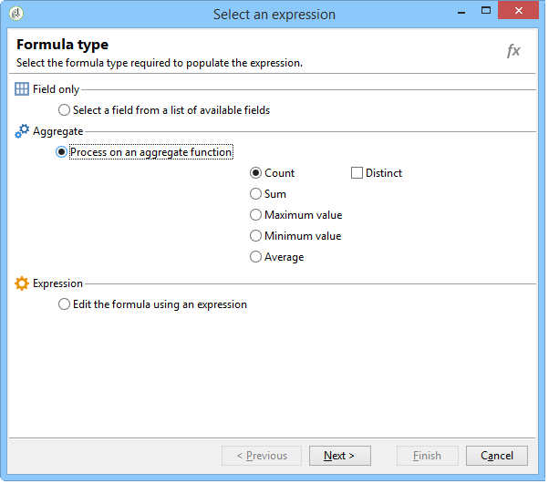

1. **[!UICONTROL Field only]****[!UICONTROL Field to select]**
1. **[!UICONTROL Aggregate (Process on an aggregate function)]**. 

   * **[!UICONTROL Count]**
   * **[!UICONTROL Sum]**
   * **[!UICONTROL Maximum value]**
   * **[!UICONTROL Minimum value]**
   * **[!UICONTROL Average]**. 

     **[!UICONTROL Distinct]**

1. **[!UICONTROL Expression]****[!UICONTROL Edit the expression]**

   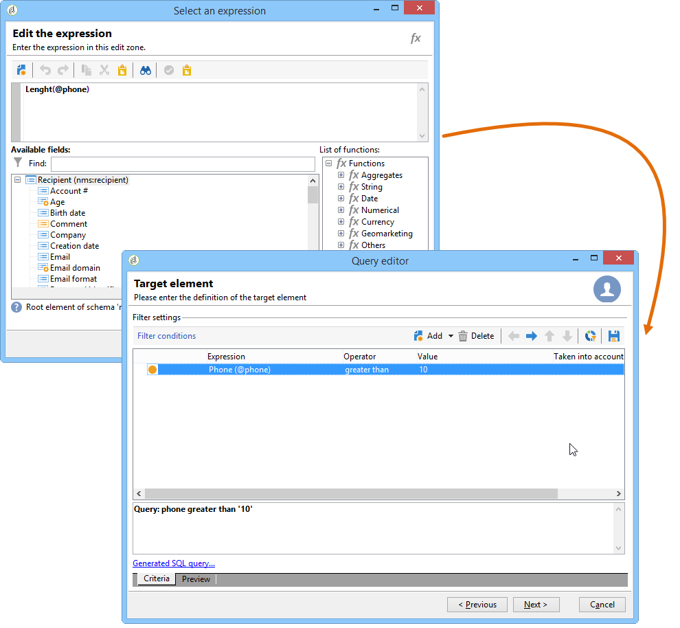

   

## 函式清單 {#list-of-functions}

**[!UICONTROL Expression]****[!UICONTROL Aggregates]****[!UICONTROL String]****[!UICONTROL Date]****[!UICONTROL Numerical]****[!UICONTROL Currency]****[!UICONTROL Geomarketing]****[!UICONTROL Windowing function]****[!UICONTROL Others]**

The expression editor looks like this:

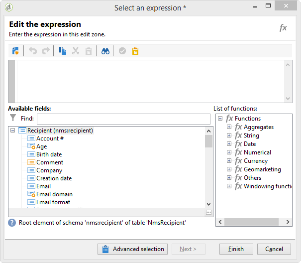

It lets you select fields in the database tables and add advanced functions to them. The following functions are available:

****

<table> 
 <tbody> 
  <tr> 
   <td> <strong>名稱</strong>  </td> 
   <td> <strong>說明</strong>  </td> 
   <td> <strong>語法</strong>  </td> 
  </tr> 
  <tr> 
   <td><strong></strong> </td> 
   <td> 傳回數字型別資料行 的平均值 </td> 
   <td> Avg(&lt;value&gt;) </td> 
  </tr> 
  <tr> 
   <td> <strong>計數</strong>  </td> 
   <td> 計算資料行 的非空值 </td> 
   <td> Count(&lt;value&gt;) </td>  
  </tr> 
  <tr> 
   <td> <strong>CountAll</strong>  </td> 
   <td> 計算傳回的值（所有欄位）  </td> 
   <td> CountAll()  </td> 
  </tr> 
  <tr> 
   <td> <strong>Countdistinct</strong>  </td> 
   <td> 計算資料行 的相異非null值 </td> 
   <td> Countdistinct(&lt;value&gt;) </td> 
  </tr> 
  <tr> 
   <td> <strong>最大</strong>  </td> 
   <td> 傳回數字、字串或日期型別資料行 的最大值 </td> 
   <td> Max(&lt;value&gt;) </td>  
  </tr> 
  <tr> 
   <td> <strong>分鐘</strong>  </td> 
   <td> 傳回數字、字串或日期型別資料行 的最小值 </td> 
   <td> Min(&lt;value&gt;) </td> 
  </tr> 
  <tr> 
   <td> <strong>StdDev</strong>  </td> 
   <td> 傳回數字、字串或日期資料行 的標準差 </td> 
   <td> stdev(&lt;value&gt;) </td> 
  </tr> 
  <tr> 
   <td> <strong>總和</strong>  </td> 
   <td> 傳回數字、字串或日期型別資料行 的值總和 </td> 
   <td> Sum(&lt;value&gt;) </td> 
  </tr> 
 </tbody> 
</table>

**字串**

<table> 
 <tbody> 
  <tr> 
   <td> <strong>名稱</strong>  </td> 
   <td> <strong>說明</strong>  </td> 
   <td> <strong>語法</strong>  </td> 
  </tr> 
  <tr> 
   <td> <strong>AllNonNull2</strong>  </td> 
   <td> 指示所有參數是否為非空值且非空白  </td> 
   <td> AllNonNull2(&lt;string&gt;， &lt;string&gt;) </td> 
  </tr> 
  <tr> 
   <td> <strong>AllNonNull3</strong>  </td> 
   <td> 指示所有參數是否為非空值且非空白  </td> 
   <td> AllNonNull3(&lt;string&gt;， &lt;string&gt;， &lt;string&gt;) </td> 
  </tr> 
  <tr> 
   <td><strong></strong> </td> 
   <td> </td> 
   <td> Ascii(&lt;string&gt;) </td> 
  </tr> 
  <tr> 
   <td> <strong>Char</strong>  </td> 
   <td> 傳回與　'n' ASCII　代碼對應的字元  </td> 
   <td> Char(&lt;number&gt;) </td>  
  </tr> 
  <tr> 
   <td> <strong>Charindex</strong>  </td> 
   <td> </td> 
   <td> Charindex(&lt;string&gt;, &lt;string&gt;) </td> 
  </tr> 
  <tr> 
   <td> <strong>GetLine</strong>  </td> 
   <td> 傳回字串的第　n　行（從　1　到　n）  </td> 
   <td> GetLine(&lt;string&gt;) </td> 
  </tr> 
  <tr> 
   <td> <strong>IfEquals</strong>  </td> 
   <td> </td> 
   <td> IfEquals(&lt;string&gt;, &lt;string&gt;, &lt;string&gt;, &lt;string&gt;) </td> 
  </tr> 
  <tr> 
   <td> <strong>IsMemoNull</strong>  </td> 
   <td> 指示作為參數傳遞的備忘錄是否為空  </td> 
   <td> IsMemoNull(&lt;memo&gt;) </td> 
  </tr> 
  <tr> 
   <td> <strong>JuxtWords</strong>  </td> 
   <td> </td> 
   <td> JuxtWords(&lt;string&gt;, &lt;string&gt;) </td> 
  </tr> 
  <tr> 
   <td> <strong>JuxtWords3</strong>  </td> 
   <td> </td> 
   <td> JuxtWords3(&lt;string&gt;, &lt;string&gt;, &lt;string&gt;) </td>  
  </tr> 
  <tr> 
   <td> <strong>LPad</strong>  </td> 
   <td> 傳回左側的已完成字串  </td> 
   <td> LPad(&lt;string&gt;, &lt;number&gt;, &lt;character&gt;) </td> 
  </tr> 
  <tr> 
   <td> <strong>Left</strong>  </td> 
   <td> 傳回字串的前　n　個字元  </td> 
   <td> Left(&lt;string&gt;, &lt;number&gt;) </td> 
  </tr> 
  <tr> 
   <td> <strong>Length</strong>  </td> 
   <td> </td> 
   <td> Length(&lt;string&gt;) </td> 
  </tr> 
  <tr> 
   <td> <strong>Lower</strong>  </td> 
   <td> 傳回小寫字串  </td> 
   <td> Lower(&lt;string&gt;) </td> 
  </tr> 
  <tr> 
   <td> <strong>Ltrim</strong>  </td> 
   <td> 移除字串左側的空格  </td> 
   <td> Ltrim(&lt;string&gt;) </td> 
  </tr> 
  <tr> 
   <td> <strong>Md5Digest</strong>  </td> 
   <td> 返回字串　MD5　鍵的十六進位表示  </td> 
   <td> Md5Digest(&lt;string&gt;) </td> 
  </tr> 
  <tr> 
   <td> <strong>MemoContains</strong>  </td> 
   <td> 指定備忘錄是否包含作為參數傳遞的字串  </td> 
   <td> MemoContains(&lt;memo&gt;, &lt;string&gt;) </td> 
  </tr> 
  <tr> 
   <td> <strong>RPad</strong>  </td> 
   <td> 傳回右側的已完成字串  </td> 
   <td> RPad(&lt;string&gt;， &lt;number&gt;， &lt;character&gt;) </td> 
  </tr> 
  <tr> 
   <td> <strong>Right</strong>  </td> 
   <td> 傳回字串的最後　n　個字元  </td> 
   <td> Right(&lt;string&gt;)  </td> 
  </tr> 
  <tr> 
   <td> <strong>Rtrim</strong>  </td> 
   <td> 移除字串右側的空格  </td> 
   <td> Rtrim(&lt;string&gt;)  </td> 
  </tr> 
  <tr> 
   <td> <strong>Smart</strong>  </td> 
   <td> 傳回字串，每個字詞的首字母以大寫表示  </td> 
   <td> Smart(&lt;string&gt;)  </td> 
  </tr> 
  <tr> 
   <td> <strong>Substring</strong>  </td> 
   <td> 從字串的字元n1開始提取長度為n2 的子字串 </td> 
   <td> Substring(&lt;string&gt;, &lt;offset&gt;, &lt;length&gt;)  </td>  
  </tr> 
  <tr> 
   <td> <strong>ToString</strong>  </td> 
   <td> 將數字轉換為字串  </td> 
   <td> ToString(&lt;number&gt;， &lt;number&gt;)  </td>  
  </tr> 
  <tr> 
   <td> <strong>Upper</strong>  </td> 
   <td> 以大寫傳回字串  </td> 
   <td> Upper(&lt;string&gt;)  </td>  
  </tr> 
  <tr> 
   <td> <strong>VirtualLink</strong>  </td> 
   <td> 傳回連結的外鍵，如果其他兩個參數相等，則傳遞為參數  </td> 
   <td> VirtualLink(&lt;number&gt;、&lt;number&gt;、&lt;number&gt;)  </td>  
  </tr> 
  <tr> 
   <td> <strong>VirtualLinkStr</strong>  </td> 
   <td> 傳回連結的外鍵（文字）索引鍵，如果其他兩個參數相等，則傳回該連結的外鍵　(text)　  </td> 
   <td> VirtualLinkStr(&lt;string&gt;, &lt;number&gt;, &lt;number&gt;)  </td>  
  </tr> 
  <tr> 
   <td> <strong>資料長度</strong>  </td> 
   <td> 傳回字串大小  </td> 
   <td> dataLength(&lt;string&gt;)  </td>  
  </tr> 
 </tbody> 
</table>

**日期**

<table> 
 <tbody> 
  <tr> 
   <td> <strong>名稱</strong>  </td> 
   <td> <strong>說明</strong>  </td> 
   <td> <strong>語法</strong>  </td> 
  </tr> 
  <tr> 
   <td> <strong>AddDays</strong>  </td> 
   <td> 新增日期的天數  </td> 
   <td> AddDays(&lt;date&gt;, &lt;number&gt;)  </td>  
  </tr> 
  <tr> 
   <td> <strong>AddHours</strong>  </td> 
   <td> 將小時數新增至日期  </td> 
   <td> AddHours(&lt;date&gt;, &lt;number&gt;)  </td>  
  </tr> 
  <tr> 
   <td> <strong>AddMinutes</strong>  </td> 
   <td> 將分鐘數新增至日期  </td> 
   <td> AddMinutes(&lt;date&gt;, &lt;number&gt;)  </td>  
  </tr> 
  <tr> 
   <td> <strong>AddMonths</strong>  </td> 
   <td> 新增月份至日期  </td> 
   <td> AddMonths(&lt;date&gt;, &lt;number&gt;)  </td>  
  </tr> 
  <tr> 
   <td> <strong>AddSeconds</strong>  </td> 
   <td> 新增秒數至日期  </td> 
   <td> AddSeconds(&lt;date&gt;, &lt;number&gt;)  </td>  
  </tr> 
  <tr> 
   <td> <strong>AddYears</strong>  </td> 
   <td> 在日期中新增多年  </td> 
   <td> AddYears(&lt;date&gt;, &lt;number&gt;)  </td>  
  </tr> 
  <tr> 
   <td> <strong>DateOnly</strong>  </td> 
   <td> 只傳回日期（時間為00:00）*  </td> 
   <td> DateOnly(&lt;date&gt;)  </td>  
  </tr> 
  <tr> 
   <td> <strong>Day</strong>  </td> 
   <td> 傳回代表日期的數字  </td> 
   <td> Day(&lt;date&gt;)  </td>  
  </tr> 
  <tr> 
   <td> <strong>DayOfYear</strong>  </td> 
   <td> 傳回日期 年中的天數 </td> 
   <td> DayOfYear(&lt;date&gt;)  </td>  
  </tr> 
  <tr> 
   <td> <strong>DaysAgo</strong>  </td> 
   <td> 傳回與目前日期對應的日期減去n天  </td> 
   <td> DaysAgo(&lt;number&gt;)  </td>  
  </tr> 
  <tr> 
   <td> <strong>DaysAgoInt</strong>  </td> 
   <td> 傳回與目前日期對應的日期（整數yyyymmdd）減去n天  </td> 
   <td> DaysAgoInt(&lt;number&gt;)  </td>  
  </tr> 
  <tr> 
   <td> <strong>DaysDiff</strong>  </td> 
   <td> 兩個日期之間的天數  </td> 
   <td> DaysDiff(&lt;end date&gt;, &lt;start date&gt;)  </td>  
  </tr> 
  <tr> 
   <td> <strong>DaysOld</strong>  </td> 
   <td> 傳回日期的年齡（以天為單位）  </td> 
   <td> DaysOld(&lt;date&gt;)  </td>  
  </tr> 
  <tr> 
   <td> <strong>GetDate</strong>  </td> 
   <td> 返回伺服器的目前系統日期  </td> 
   <td> GetDate()  </td> 
  </tr> 
  <tr> 
   <td> <strong>Hour</strong>  </td> 
   <td> 傳回日期的小時數  </td> 
   <td> Hour(&lt;date&gt;)  </td>  
  </tr> 
  <tr> 
   <td> <strong>HoursDiff</strong>  </td> 
   <td> 傳回兩個日期之間的小時數  </td> 
   <td> HoursDiff(&lt;end date&gt;, &lt;start date&gt;)  </td>  
  </tr> 
  <tr> 
   <td> <strong>Minute</strong>  </td> 
   <td> 傳回日期的分鐘數  </td> 
   <td> Minute(&lt;date&gt;)  </td>  
  </tr> 
  <tr> 
   <td> <strong>MinutesDiff</strong>  </td> 
   <td> 傳回兩個日期之間的分鐘數  </td> 
   <td> MinutesDiff(&lt;end date&gt;, &lt;start date&gt;)  </td>  
  </tr> 
  <tr> 
   <td> <strong>Month</strong>  </td> 
   <td> 傳回代表日期月份的數字  </td> 
   <td> Month(&lt;date&gt;)  </td>  
  </tr> 
  <tr> 
   <td> <strong>MonthsAgo</strong>  </td> 
   <td> 傳回與目前日期對應的日期減去n個月  </td> 
   <td> MonthsAgo(&lt;number&gt;)  </td>  
  </tr> 
  <tr> 
   <td> <strong>MonthsDiff</strong>  </td> 
   <td> 傳回兩個日期之間的月數  </td> 
   <td> MonthsDiff(&lt;end date&gt;, &lt;start date&gt;)  </td>  
  </tr> 
  <tr> 
   <td> <strong>MonthsOld</strong>  </td> 
   <td> 傳回日期的月份  </td> 
   <td> MonthsOld(&lt;date&gt;)  </td>  
  </tr> 
  <tr> 
   <td> <strong>Second</strong>  </td> 
   <td> 傳回日期的秒數  </td> 
   <td> Second(&lt;date&gt;)  </td>  
  </tr> 
  <tr> 
   <td> <strong>SecondsDiff</strong>  </td> 
   <td> 傳回兩個日期之間的秒數  </td> 
   <td> SecondsDiff(&lt;end date&gt;, &lt;start date&gt;)  </td>  
  </tr> 
  <tr> 
   <td> <strong>SubDays</strong>  </td> 
   <td> 從日期減去天數  </td> 
   <td> SubDays(&lt;date&gt;, &lt;number&gt;)  </td>  
  </tr> 
  <tr> 
   <td> <strong>SubHours</strong>  </td> 
   <td> 從日期減去數小時  </td> 
   <td> SubHours(&lt;date&gt;, &lt;number&gt;)  </td>  
  </tr> 
  <tr> 
   <td> <strong>SubMinutes</strong>  </td> 
   <td> 從日期減去分鐘數  </td> 
   <td> SubMinutes(&lt;date&gt;, &lt;number&gt;)  </td>  
  </tr> 
  <tr> 
   <td> <strong>SubMonths</strong>  </td> 
   <td> 從日期減去幾個月  </td> 
   <td> SubMonths(&lt;date&gt;, &lt;number&gt;)  </td>  
  </tr> 
  <tr> 
   <td> <strong>SubSeconds</strong>  </td> 
   <td> 從日期減去秒數  </td> 
   <td> SubSeconds(&lt;date&gt;, &lt;number&gt;)  </td>  
  </tr> 
  <tr> 
   <td> <strong>SubYears</strong>  </td> 
   <td> 從日期減去數年  </td> 
   <td> SubYears(&lt;date&gt;, &lt;number&gt;)  </td>  
  </tr> 
  <tr> 
   <td> <strong>ToDate</strong>  </td> 
   <td> 將日期　+　時間轉換為日期  </td> 
   <td> ToDate(&lt;date + time&gt;)  </td>  
  </tr> 
  <tr> 
   <td> <strong>ToDateTime</strong>  </td> 
   <td> 將字串轉換為日期+時間  </td> 
   <td> ToDateTime(&lt;string&gt;)  </td>  
  </tr> 
  <tr> 
   <td> <strong>TruncDate</strong>  </td> 
   <td> 將日期+時間四捨五入至最接近的秒數  </td> 
   <td> TruncDate(@lastModified, &lt;number of seconds&gt;)  </td> 
  </tr> 
  <tr> 
   <td> <strong>TruncDateTZ</strong>  </td> 
   <td> 將日期+時間四捨五入為以秒為單位的指定精確度  </td> 
   <td> TruncDateTZ(&lt;date&gt;, &lt;number of seconds&gt;, &lt;time zone&gt;)  </td> 
  </tr> 
  <tr> 
   <td> <strong>TruncQuarter</strong>  </td> 
   <td> 將日期捨入為季度  </td> 
   <td> TruncQuarter(&lt;date&gt;)  </td>  
  </tr> 
  <tr> 
   <td> <strong>TruncTime</strong>  </td> 
   <td> 將時間部分捨入到最接近的秒數  </td> 
   <td> TruncTim(e&lt;date&gt;， &lt;number of seconds&gt;)  </td>  
  </tr> 
  <tr> 
   <td> <strong>TruncWeek</strong>  </td> 
   <td> 將日期捨入為一週  </td> 
   <td> TruncWeek(&lt;date&gt;)  </td>  
  </tr> 
  <tr> 
   <td> <strong>TruncYear</strong>  </td> 
   <td> 將日期+時間捨入至年度的　1　月　1　日  </td> 
   <td> TruncYear(&lt;date&gt;)  </td>  
  </tr> 
  <tr> 
   <td> <strong>TruncWeek</strong>  </td> 
   <td> 傳回代表日期當週中某天的數字  </td> 
   <td> WeekDay(&lt;date&gt;)  </td>  
  </tr> 
  <tr> 
   <td> <strong>年</strong>  </td> 
   <td> 傳回代表日期年份的數字  </td> 
   <td> Year(&lt;date&gt;)  </td>  
  </tr> 
  <tr> 
   <td> <strong>YearAnd Month</strong>  </td> 
   <td> 傳回代表日期的年份和月份的數字  </td> 
   <td> YearAndMonth(&lt;date&gt;)  </td>  
  </tr> 
  <tr> 
   <td> <strong>YearsDiff</strong>  </td> 
   <td> 傳回兩個日期之間的年數  </td> 
   <td> YearsDiff(&lt;end date&gt;, &lt;start date&gt;)  </td>  
  </tr> 
  <tr> 
   <td> <strong>YearsOld</strong>  </td> 
   <td> 傳回日期的年齡  </td> 
   <td> YearsOld(&lt;date&gt;)  </td>  
  </tr> 
 </tbody> 
</table>

>[!NOTE]
>
>請注意，**Dateonly**&#x200B;函式會考量伺服器的時區，而非運運算元的時區。

**數值**

<table> 
 <tbody> 
  <tr> 
   <td> <strong>名稱</strong>  </td> 
   <td> <strong>說明</strong>  </td> 
   <td> <strong>語法</strong>  </td> 
  </tr> 
  <tr> 
   <td> <strong>Abs</strong>  </td> 
   <td> 返回數字的絕對值  </td> 
   <td> Abs(&lt;number&gt;)  </td>  
  </tr> 
  <tr> 
   <td> <strong>Ceil</strong>  </td> 
   <td> 傳回大於或等於數字的最小整數  </td> 
   <td> Ceil(&lt;number&gt;)  </td>  
  </tr> 
  <tr> 
   <td> <strong>Floor</strong>  </td> 
   <td> 傳回大於或等於數字 的最大整數 </td> 
   <td> Floor(&lt;number&gt;)  </td>  
  </tr> 
  <tr> 
   <td> <strong>Greatest</strong>  </td> 
   <td> 傳回兩個數字中的較大值  </td> 
   <td> Greatest(&lt;number 1&gt;, &lt;number 2&gt;)  </td>  
  </tr> 
  <tr> 
   <td> <strong>Least</strong>  </td> 
   <td> 傳回兩個數字中的較小者  </td> 
   <td> Least(&lt;number 1&gt;, &lt;number 2&gt;)  </td>  
  </tr> 
  <tr> 
   <td> <strong>Mod</strong>  </td> 
   <td> 傳回n1除以n2 的整數除法的餘數 </td> 
   <td> Mod(&lt;number 1&gt;, &lt;number 2&gt;)  </td>  
  </tr> 
  <tr> 
   <td> <strong>Percent</strong>  </td> 
   <td> 傳回兩個數字的比率，以百分比表示  </td> 
   <td> Percent(&lt;number 1&gt;, &lt;number 2&gt;)  </td>  
  </tr> 
  <tr> 
   <td> <strong>Random</strong>  </td> 
   <td> 傳回隨機值  </td> 
   <td> Random()  </td> 
  </tr> 
  <tr> 
   <td> <strong>Round</strong>  </td> 
   <td> 將數字四捨五入為n個小數  </td> 
   <td> Round(&lt;number&gt;, &lt;number of decimals&gt;)  </td>  
  </tr> 
  <tr> 
   <td> <strong>Sign</strong>  </td> 
   <td> 傳回數字元號  </td> 
   <td> Sign(&lt;number&gt;)  </td>  
  </tr> 
  <tr> 
   <td> <strong>ToDouble</strong>  </td> 
   <td> 將整數轉換為浮點數  </td> 
   <td> ToDouble(&lt;number&gt;)  </td>  
  </tr> 
  <tr> 
   <td> <strong>ToInt64</strong>  </td> 
   <td> 將浮點數轉換為　64　位整數  </td> 
   <td> ToInt64(&lt;number&gt;)  </td>  
  </tr> 
  <tr> 
   <td> <strong>ToInteger</strong>  </td> 
   <td> 將浮點數轉換為整數  </td> 
   <td> ToInteger(&lt;number&gt;)  </td>  
  </tr> 
  <tr> 
   <td> <strong>Trunc</strong>  </td> 
   <td> 截斷　n1　到　n2　小數  </td> 
   <td> Trunc(&lt;n1&gt;, &lt;n2&gt;)  </td>  
  </tr> 
 </tbody> 
</table>

1. 貨幣

<table> 
 <tbody> 
  <tr> 
   <td> <strong>名稱</strong>  </td> 
   <td> <strong>說明</strong>  </td> 
   <td> <strong>語法</strong>  </td> 
  </tr> 
  <tr> 
   <td> <strong>ConvertCurrency</strong>  </td> 
   <td> 將來源貨幣的金額轉換為目標貨幣 的金額 </td> 
   <td> ConvertCurrency(&lt;amount&gt;， &lt;source currency&gt;， &lt;target currency&gt;， &lt;conversion date&gt;)  </td>  
  </tr> 
  <tr> 
   <td> <strong>FormatCurrency</strong>  </td> 
   <td> 根據選取的貨幣設定來格式化顯示的金額  </td> 
   <td> FormatCurrency(&lt;amount&gt;， &lt;currency&gt;)  </td>  
  </tr> 
 </tbody> 
</table>

**地理行銷**

<table> 
 <tbody> 
  <tr> 
   <td> <strong>名稱</strong>  </td> 
   <td> <strong>說明</strong>  </td> 
   <td> <strong>語法</strong>  </td> 
  </tr> 
  <tr> 
   <td> <strong>距離</strong>  </td> 
   <td> 傳回由經度和緯度定義的兩點之間的距離，以度表示。  </td> 
   <td> 距離（&lt;Longitude A&gt;, &lt;Latitude A&gt;, &lt;Longitude B&gt;, &lt;Latitude B&gt;）  </td>  
  </tr> 
 </tbody> 
</table>

**其他**

<table> 
 <tbody> 
  <tr> 
   <td> <strong>名稱</strong>  </td> 
   <td> <strong>說明</strong>  </td> 
   <td> <strong>語法</strong>  </td> 
  </tr> 
  <tr> 
   <td> <strong>案例</strong>  </td> 
   <td> </td> 
   <td> Case(When(&lt;condition&gt;, &lt;value 1&gt;), Else(&lt;value 2&gt;))  </td> 
  </tr> 
  <tr> 
   <td> <strong>ClearBit</strong>  </td> 
   <td> 刪除值中的旗標  </td> 
   <td> ClearBit(&lt;identifier&gt;, &lt;flag&gt;)  </td>  
  </tr> 
  <tr> 
   <td> <strong>合併</strong>  </td> 
   <td> 如果值　1　為　零或　null，則傳回值　2，否則傳回值　1  </td> 
   <td> Coalesce(&lt;value 1&gt;, &lt;value 2&gt;)  </td>  
  </tr> 
  <tr> 
   <td> <strong>Decode</strong>  </td> 
   <td> </td> 
   <td> Decode(&lt;value 1&gt;, &lt;value 2&gt;, &lt;value 3&gt;, &lt;value 4&gt;)  </td>  
  </tr> 
  <tr> 
   <td> <strong>Else</strong>  </td> 
   <td> 傳回值　1（只能用作　case　函式的參數）  </td> 
   <td> </td>  
  </tr> 
  <tr> 
   <td> <strong>GetEmailDomain</strong>  </td> 
   <td> 從電子郵件地址中擷取網域  </td> 
   <td> GetEmailDomain(&lt;value&gt;)  </td>  
  </tr> 
  <tr> 
   <td> <strong>GetMirrorURL</strong>  </td> 
   <td> 檢索鏡像頁面伺服器的URL  </td> 
   <td> GetMirrorURL(&lt;value&gt;)  </td>  
  </tr> 
  <tr> 
   <td> <strong>Iif</strong>  </td> 
   <td> </td> 
   <td> Iif(&lt;condition&gt;, &lt;value 1&gt;, &lt;value 2&gt;)  </td>  
  </tr> 
  <tr> 
   <td> <strong>IsBitSet</strong>  </td> 
   <td> 指出旗標是否在值中  </td> 
   <td> IsBitSet(&lt;identifier&gt;, &lt;flag&gt;)  </td>  
  </tr> 
  <tr> 
   <td> <strong>IsEmptyString</strong>  </td> 
   <td> </td> 
   <td> </td>  
  </tr> 
  <tr> 
   <td> <strong>NoNull</strong>  </td> 
   <td> 如果引數為　NULL，則返回空字串  </td> 
   <td> NoNull(&lt;value&gt;)  </td>   
  </tr> 
  <tr> 
   <td> <strong>RowId</strong>  </td> 
   <td> 返回行號  </td> 
   <td> RowId  </td> 
  </tr> 
  <tr> 
   <td> <strong>SetBit</strong>  </td> 
   <td> 強制值中的旗標  </td> 
   <td> SetBit(&lt;identifier&gt;, &lt;flag&gt;)  </td>  
  </tr> 
  <tr> 
   <td> <strong>ToBoolean</strong>  </td> 
   <td> 將數字轉換為布林值  </td> 
   <td> ToBoolean(&lt;number&gt;)  </td>   
  </tr> 
  <tr> 
   <td> <strong>When</strong>  </td> 
   <td> </td> 
   <td> When(&lt;condition&gt;, &lt;value 1&gt;)  </td>  
  </tr> 
 </tbody> 
</table>

****

<table> 
 <tbody> 
  <tr> 
   <td> <strong>名稱</strong>  </td> 
   <td> <strong>說明</strong>  </td> 
   <td> <strong>語法</strong>  </td> 
  </tr> 
  <tr> 
   <td> <strong>Desc</strong>  </td> 
   <td> 套用遞減排序  </td> 
   <td> Desc(&lt;value 1&gt;)  </td>  
  </tr> 
  <tr> 
   <td> <strong>OrderBy</strong>  </td> 
   <td> 對分區內的結果進行排序  </td> 
   <td> OrderBy(&lt;value 1&gt;)  </td>  
  </tr> 
  <tr> 
   <td> <strong>PartitionBy</strong>  </td> 
   <td> 對表上的查詢結果進行分區  </td> 
   <td> PartitionBy(&lt;value 1&gt;)  </td>  
  </tr> 
  <tr> 
   <td> <strong>RowNum</strong>  </td> 
   <td> </td> 
   <td> RowNum(PartitionBy(&lt;value 1&gt;), OrderBy(&lt;value 1&gt;))  </td> 
  </tr> 
 </tbody> 
</table>
