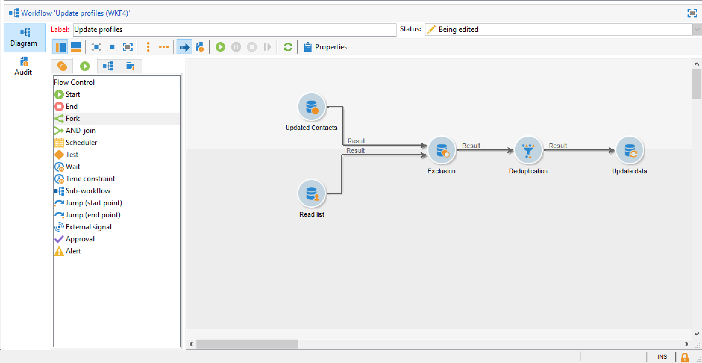

# 將資料匯入 Campaign {#ootb-profiles}

Campaign 可協助您將聯絡人新增至雲端資料庫。 您可以載入檔案、排程並自動化多個聯絡人更新、在網路上收集資料，或直接在收件者表格中輸入設定檔資訊。

??開始使用[audiences](audiences.md)
??了解促銷活動[資料模型](../dev/datamodel.md)

## 在工作流程中匯入設定檔

設定檔匯入是在專用範本中設定的，專用範本則是在工作流程透過&#x200B;**匯入**&#x200B;活動執行。 它們可以根據排程自動重複，例如多個資訊系統之間的自動化資料交換。在 [Campaign Classic v7 文件](https://experienceleague.adobe.com/docs/campaign-classic/using/getting-started/importing-and-exporting-data/import-export-workflows.html?lang=zh-Hant){target=&quot;_blank&quot;} 深入瞭解。

在 Campaign Classic v7 文件深入瞭解：

↗️ [開始匯入和匯出](https://experienceleague.adobe.com/docs/campaign-classic/using/getting-started/importing-and-exporting-data/get-started-data-import-export.html?lang=zh-Hant){target=&quot;_blank&quot;}

↗️ [匯入和匯出最佳實務](https://experienceleague.adobe.com/docs/campaign-classic/using/getting-started/importing-and-exporting-data/best-practices/import-export-best-practices.html?lang=zh-Hant){target=&quot;_blank&quot;}

↗️ [設定並執行匯入](https://experienceleague.adobe.com/docs/campaign-classic/using/getting-started/importing-and-exporting-data/generic-imports-exports/executing-import-jobs.html?lang=zh-Hant){target=&quot;_blank&quot;}

## 執行單一匯入

建立並執行一般資料匯入作業，以載入雲端資料庫中的聯絡人。

↗️了解如何在[Campaign Classicv7檔案](https://experienceleague.adobe.com/docs/campaign-classic/using/getting-started/importing-and-exporting-data/generic-imports-exports/about-generic-imports-exports.html?lang=zh-Hant){target=&quot;_blank&quot;}中執行統一匯入作業以饋送資料庫。

## 透過網頁應用程式收集設定檔

使用 Campaign 建立網路表單，輕鬆、有效率地收集並管理設定檔資訊。 您可以在您的網站共用這些表單，讓您的聯絡人輕鬆提供資訊。 他們的資訊會傳送至 Campaign 建立其設定檔，或更新其資訊 (如果資訊已存在於資料庫中)。

↗️了解如何在[Campaign Classicv7檔案](https://experienceleague.adobe.com/docs/campaign-classic/using/designing-content/web-forms/about-web-forms.html?lang=zh-Hant){target=&quot;_blank&quot;}中建立網路表單。

**相關主題**

* [建立對象](audiences.md)
* [刪除重複的設定檔](https://experienceleague.adobe.com/docs/campaign-classic/using/automating-with-workflows/use-cases/data-management/deduplication-merge.html?lang=zh-Hant){target=&quot;_blank&quot;}
* [擴充設定檔資料](https://experienceleague.adobe.com/docs/campaign-classic/using/automating-with-workflows/use-cases/data-management/enriching-data.html?lang=ko){target=&quot;_blank&quot;}
