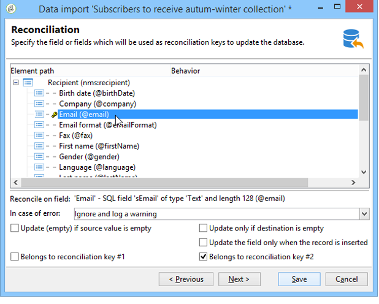

# 將資料匯入 Campaign {#ootb-profiles}

Campaign可協助您將連絡人新增至資料庫。 您可以載入檔案、排程並自動化多個聯絡人更新、在網路上收集資料，或直接在收件者表格中輸入輪廓資訊。

輪廓匯入是在專用範本中設定的，專用範本則是在工作流程透過&#x200B;**匯入**&#x200B;活動執行。 它們可以根據排程自動重複，例如多個資訊系統之間的自動化資料交換。在[本節](../../automation/workflow/recurring-import-workflow.md)了解更多資訊。

## 執行匯入

Adobe Campaign可讓您以文字、CSV、TAB或XML格式，從一或多個檔案將資料匯入資料庫。 這些檔案與表 (主要或連結) 相關聯，並且源檔的每個欄位與資料庫的欄位相關聯。

>[!NOTE]
>
>您可以使用&#x200B;**[!UICONTROL Import a list]**&#x200B;函式，匯入資料時不必與資料庫資料對應。 然後可透過&#x200B;**[!UICONTROL Read list]**&#x200B;物件將資料僅用於工作流程中。 如需詳細資訊，請參閱[此頁面](../../automation/workflow/read-list.md)。

## 使用匯入助理

匯入助理可以讓您設定匯入、定義其選項（例如資料轉換）並啟動執行。 它是一系列屏幕，其內容取決於匯入類型 (簡單或多個) 和操作員權限。

建立新的匯入工作後，匯入助理就會顯示。

在來源檔案中，每一行都與記錄一致。 記錄中的資料以分隔符號（空格、定位字元、字元等）分隔。 這意味著以行的形式檢索資料，並且每行與資料庫的欄位相關聯。

### 步驟1 — 選擇匯入範本 {#step-1---choosing-the-import-template}

啟動匯入助理時，您必須先選取範本。 例如，要配置收到簡報的收件者的匯入，請按照以下步驟操作：

1. 選取&#x200B;**[!UICONTROL Profiles and Targets > Job > Generic imports and exports]**&#x200B;資料夾。
1. 點擊&#x200B;**新建**，然後點擊&#x200B;**匯入**&#x200B;以建立匯入範本。

   

1. 按一下&#x200B;**[!UICONTROL Import template]**&#x200B;欄位右側的箭頭以選取您的範本，或按一下&#x200B;**[!UICONTROL Select link]**&#x200B;以瀏覽樹狀結構。

   原生範本為&#x200B;**[!UICONTROL New text import]**。 此範本不得修改，但您可以複製此範本，以根據您的需求設定新範本。 匯入範本預設會儲存在&#x200B;**[!UICONTROL Profiles and targets > Templates > Job templates]**&#x200B;節點中。

1. 在&#x200B;**[!UICONTROL Label]**&#x200B;欄位中輸入此匯入的名稱。 您可以添加描述。
1. 在適當的欄位中選取匯入型別。 有兩種可能的匯入型別： **[!UICONTROL Simple import]**&#x200B;僅匯入一個檔案，以及&#x200B;**[!UICONTROL Multiple import]**&#x200B;在單一執行中匯入多個檔案。

   若要多重匯入，請從匯入助理第一個畫面的&#x200B;**[!UICONTROL Multiple import]**&#x200B;下拉式清單中選取&#x200B;**[!UICONTROL Import type]**。

   

1. 按一下&#x200B;**[!UICONTROL Add]**&#x200B;以指定要匯入的欄位。

   

   每次新增檔案時，都會顯示&#x200B;**[!UICONTROL File to import]**&#x200B;助理的畫面。 請參閱區段[步驟2 - Source檔案選擇](#step-2---source-file-selection)，並依照助理中的步驟將匯入選項定義為簡單匯入。

   >[!NOTE]
   >
   >多次匯入應僅滿足特定需求，不建議使用。

#### 第 2 步 - 源檔選擇 {#step-2---source-file-selection}

源檔可以是文字格式 (txt、csv、tab、固定行) 或 xml。

預設會選取&#x200B;**[!UICONTROL Upload file on the server]**。 按一下&#x200B;**[!UICONTROL Local file]**&#x200B;欄位右側的資料夾，以瀏覽本機磁碟並選取要匯入的檔案。 您可以取消選擇此選項以輸入存取路徑以及要在伺服器上匯入的檔案名稱。

指定檔案後，您可以按一下&#x200B;**[!UICONTROL Auto-detect format]**，在視窗的下半部檢視其資料。 此預覽顯示源檔案的前 200 行。

使用此檢視上方提供的選項來設定匯入。 透過這些選項定義的引數會傳輸到預覽中。 可以使用以下選項：

* **[!UICONTROL Click here to change the file format...]**&#x200B;可讓您檢查檔案格式並微調組態。
* **[!UICONTROL Update on server...]**&#x200B;可讓您將本機檔案傳輸至伺服器。 只有在選取&#x200B;**[!UICONTROL Upload file on the server]**&#x200B;時，才能使用此選項。
* **[!UICONTROL Download]**&#x200B;只有在檔案已上傳至伺服器時才可使用。
* **[!UICONTROL Auto-detect format]**&#x200B;用來重新初始化資料來源的格式。 此選項可讓您將原始格式重新套用至已透過&#x200B;**[!UICONTROL Click here to change the file format...]**&#x200B;選項格式化的資料。
* **[!UICONTROL Advanced parameters]**&#x200B;連結可讓您篩選來源資料並存取進階選項。 在此熒幕中，您可以選擇僅匯入檔案的一部分。 您也可以定義篩選器，例如根據對應行的值，僅匯入「Prospect」或「Customer」型別的使用者。 這些選項僅供專業 JavaScript 用戶使用。

### 變更檔案格式 {#changing-the-file-format}

**[!UICONTROL Click here to change the file format...]**&#x200B;選項可讓您格式化來源檔案的資料，尤其是指定欄分隔符號和每個欄位的資料型別。 此配置通過以下視窗執行：

此步驟可讓您說明應如何讀取檔案欄位的值。 例如，若是日期，日期或日期+時間資料可能與格式（dd/mm/yyyy、mm/dd/yy等）相關聯。 如果輸入資料與預期格式不匹配，則在匯入期間將發生拒絕。

您可以在視窗下部的預覽區欄位中查看配置結果。

按一下&#x200B;**[!UICONTROL OK]**&#x200B;儲存格式，然後按一下&#x200B;**[!UICONTROL Next]**&#x200B;顯示下一步。

### 第 3 步 - 欄位對應 {#step-3---field-mapping}

然後，您必須選擇目標架構並將每行的資料對應到資料庫中的欄位。

* **[!UICONTROL Destination schema]**&#x200B;欄位可讓您選取要匯入資料的結構描述。 此資訊為必填。 按一下&#x200B;**[!UICONTROL Select link]**&#x200B;圖示以選取其中一個現有結構描述。 按一下&#x200B;**[!UICONTROL Edit link]**&#x200B;以顯示所選資料表的內容。
* 中央表格會顯示來源檔案中定義的所有欄位。 選取要匯入的欄位，以將目的地檔案與其建立關聯。 可以手動或自動對應這些欄位。

  若要手動對應欄位，請按一下核取方塊以選取來源欄位，然後按一下第二欄以啟動與所選欄位相對應的儲存格。 接著，按一下&#x200B;**[!UICONTROL Edit expression]**&#x200B;圖示以顯示目前表格的所有欄位。 選取目的地欄位並按一下&#x200B;**[!UICONTROL OK]**&#x200B;以驗證對應。

  若要自動關聯來源欄位和目的地欄位，請按一下欄位清單右側的&#x200B;**[!UICONTROL Guess the destination fields]**&#x200B;圖示。 如果需要，可以修改建議的欄位。

  >[!IMPORTANT]
  >
  >在繼續執行下一步之前，必須始終驗證此操作的結果。

* 您可以將轉換套用至匯入的欄位。 若要這麼做，請按一下與相關欄位相關的&#x200B;**[!UICONTROL Transformation]**&#x200B;欄儲存格，然後選取要套用的轉換。

  

  >[!IMPORTANT]
  >
  >轉換會在匯入時套用。 但是，如果已定義了對目標欄位的約束 (在上面的示例中為 @lastname 欄位)，則這些約束優先。

* 您可以使用位於中央表格右側的適當圖示來新增計算欄位。 計算欄位可讓您執行複雜的轉換、新增虛擬欄或合併多個欄的資料。 有關各種可能性的詳細資訊，請參見以下部分。

#### 計算欄位 {#calculated-fields}

計算欄位是指新增至來源檔案的新欄，以及從其他欄計算。 計算欄位隨後可與Adobe Campaign資料庫的欄位建立關聯。 但是，在計算欄位中無法進行對帳操作。

有四種類型的計算欄位：

* **[!UICONTROL Fixed string]**：來源檔案的所有行，計算欄位的值都相同。 可讓您設定插入或更新之記錄的欄位值。 例如，您可以為所有匯入的記錄將標記設置為「是」。
* **[!UICONTROL String with JavaScript tags]**：計算欄位的值是包含JavaScript命令的字元字串。
* **[!UICONTROL JavaScript expression]**：計算欄位的值是JavaScript函式評估的結果。 返回的值可以是數字、日期等。
* **[!UICONTROL Enumeration]**：欄位的值是根據來源檔案中包含的值所歸因。 編輯器允許您指定源行並輸入枚舉值清單，如以下示例所示：

  

  **[!UICONTROL Preview]**&#x200B;索引標籤可讓您檢視已定義組態的結果。 已在此新增&#x200B;**[!UICONTROL Subscription]**&#x200B;欄。 該值計算自&#x200B;**狀態**&#x200B;欄位。

  

### 第 4 步 – 調解 {#step-4---reconciliation}

匯入輔助程式的調解步驟可讓您定義從檔案中調解資料與資料庫中現有資料的模式，並設定檔案資料與資料庫資料之間的優先順序規則。 配置視窗如下所示：

屏幕的中央部分包含一個樹結構，其中包含要匯入資料的 Adobe Campaign 資料庫的欄位和表。

每個節點（表格或欄位）都有特殊選項可用。 當您按一下清單中相關的節點時，其引數和簡短說明會顯示在下方。 為每個元素定義的行為會顯示在對應的&#x200B;**[!UICONTROL Behavior]**&#x200B;欄中。

#### 操作類型 {#types-of-operation}

對於匯入涉及的每個表格，您必須定義作業型別。 以下操作可用於資料庫的主要元素：

* **[!UICONTROL Update or insertion]**：如果記錄存在於資料庫中，則更新記錄，否則建立記錄。
* **[!UICONTROL Insertion]**：將記錄插入資料庫。
* **[!UICONTROL Update]**：僅更新現有記錄（忽略其他記錄）。
* **[!UICONTROL Reconciliation only]**：在資料庫中尋找記錄，但未執行更新。 例如，允許您根據檔案行關聯要匯入的收件者資料夾，而不更新資料夾中的資料。
* **[!UICONTROL Deletion]**：可讓您銷毀資料庫中的記錄。

匯入所涉及的表中的每個欄位都有以下選項：

* **[!UICONTROL Update (empty) if source value is empty]**：在更新事件中，如果來源檔案中的欄位為空，則欄位中的值將會移除資料庫值。 否則，保留資料庫欄位。
* **[!UICONTROL Update only if destination is empty]**：除非資料庫欄位是空的，否則來源檔案中的值不會覆寫資料庫欄位中的值。 在這種情況下，它採用源檔的值。
* **[!UICONTROL Update the field only when the record is inserted]**：在更新或插入作業期間，只會匯入新的來源檔案記錄。

>[!NOTE]
>
>除非在沒有重複資料刪除的情況下插入，否則調解金鑰的定義始終是&#x200B;**必需的**。

#### 調解金鑰 {#reconciliation-keys}

必須至少填寫一個調解金鑰才能管理重複資料刪除。

調解金鑰是用於識別記錄的一組欄位。 例如，若要匯入收件者，調解金鑰可以是帳號、「電子郵件」欄位或「姓氏、名字、公司」欄位等。

在此情況下，為了找出檔案的一行是否符合資料庫中的現有收件者，匯入引擎會比較檔案的值與資料庫中索引鍵所有欄位的值。 當欄位是記錄專屬時，可以執行來源和目的地資料之間的精細比較，以確保匯入後資料的完整性。 可以為同一個表填寫第二個調解金鑰；它用於第一個金鑰為空的行。

避免選擇在匯入期間可能被修改的欄位；如果發生這種情況，引擎可以建立其他記錄。

>[!NOTE]
>
>對於收件者匯入，所選資料夾的標識符將隱含地添加到金鑰中。
>
>因此，僅對此資料夾執行調解 (除非未選擇資料夾)。

#### 重複資料刪除 {#deduplication}

>[!NOTE]
>
>「兩次」是在要匯入的檔案中存在兩次或更多次的項目。
>
>「重複」是同時存在於要匯入的檔案和資料庫中的項目。

**[!UICONTROL Management of doubles]**&#x200B;欄位可讓您設定重複資料刪除。 重複資料刪除涉及&#x200B;**在源檔中**&#x200B;多次出現的記錄 (或多檔案匯入時的源檔)，即調解金鑰的欄位相同的行。

* 在&#x200B;**[!UICONTROL Update]**&#x200B;模式（預設模式）下的重複資料刪除管理不會執行重複資料刪除。 因此，最後的記錄具有優先權（因為它會更新先前記錄的資料）。 在此模式下不執行重複計數。
* 在&#x200B;**[!UICONTROL Ignore]**&#x200B;模式或&#x200B;**[!UICONTROL Reject entity]**&#x200B;中的重複管理會排除匯入中的重複專案。 在這種情況下，不會匯入任何記錄。
* 在&#x200B;**[!UICONTROL Reject entity]**&#x200B;模式中，不會匯入元素，而且匯入記錄檔中會產生錯誤。
* 在&#x200B;**[!UICONTROL Ignore]**&#x200B;模式中，未匯入元素，但並未保留任何錯誤追蹤。 此模式可讓您優化性能。

>[!IMPORTANT]
>
>重複資料刪除僅在記憶體中執行。 因此，具有重複資料刪除之匯入的大小會受到限制。 此限制取決於幾個引數（應用程式伺服器的容量、活動、索引鍵中的欄位數等）。 重複資料刪除的最大大小為 1,000,000 行。

重複資料刪除涉及同時存在於來源檔案和資料庫中的記錄。 它只與更新有關的作業（亦即&#x200B;**[!UICONTROL Update and insertion]**&#x200B;或&#x200B;**[!UICONTROL Update]**）。 **[!UICONTROL Duplicate management]**&#x200B;選項可讓您更新或忽略記錄（如果記錄同時位於來源檔案和資料庫中）。 **[!UICONTROL Update or insert based on origin]**&#x200B;選項屬於選擇性模組，無法用於標準內容。

選項&#x200B;**[!UICONTROL Reject]**&#x200B;和&#x200B;**[!UICONTROL Ignore]**&#x200B;的運作方式如上所示。

### 發生錯誤時 {#behavior-in-the-event-of-an-error}

大部分的資料傳輸作業會產生各種型別的錯誤（不一致的行格式、無效的電子郵件地址等）。 匯入引擎生成的所有錯誤和所有警告都將儲存並連結到匯入執行個體。

您可以透過&#x200B;**[!UICONTROL Rejects]**&#x200B;索引標籤檢視這些拒絕的詳細資料。

拒絕有兩種型別（型別會顯示在&#x200B;**[!UICONTROL Connector]**&#x200B;欄中）：

* 拒絕文字聯結器與處理檔案行時發生的錯誤有關（計算欄位、資料分析等）。 在這種情況下，如果發生錯誤，則始終拒絕整行。
* 資料庫聯結器拒絕與資料協調或寫入資料庫期間發生的錯誤有關。 在匯入到多個表的情況下，拒絕只涉及記錄的一部分 (例如，對於收件者和相關事件的匯入，錯誤可以阻止更新事件而不拒絕接收者)。

在資料調解頁面中，您可以按欄位和逐個表定義所需的錯誤管理類型欄位。

* **[!UICONTROL Ignore and log a warning]**：所有欄位都已匯入資料庫，但產生錯誤的欄位除外。
* **[!UICONTROL Reject parent element]**：記錄的整行被拒絕，而不僅僅是造成錯誤的欄位。
* **[!UICONTROL Reject all elements]**：匯入停止，且記錄的所有元素都遭到拒絕。

  

匯入執行個體的拒絕屏幕中的樹結構指示哪些欄位被拒絕以及錯誤發生的位置。

您可以透過&#x200B;**[!UICONTROL Export rejects]**&#x200B;圖示產生包含這些記錄的檔案：

### 第 5 步 - 匯入收件者時的附加步驟 {#step-5---additional-step-when-importing-recipients}

匯入助理的下一個步驟可讓您選取或建立資料匯入所在的資料夾、自動對應匯入的收件者與（新的或現有的）清單，以及將收件者訂閱至服務。

>[!NOTE]
>
>此步驟只會在匯入收件者時，以及使用預設Adobe Campaign收件者表格(**nms:recipient**)時顯示。

* 按一下&#x200B;**[!UICONTROL Edit]**&#x200B;連結以選取資料夾、清單，或您要與收件者建立關聯或訂閱的服務。

   1. 匯入到資料夾中

      **[!UICONTROL Edit...]**&#x200B;區段的&#x200B;**[!UICONTROL Import into a folder]**&#x200B;連結可讓您選取或建立收件者將匯入的資料夾。 按照預設，如果未定義分區，則會將資料匯入到操作員的預設資料夾中。

      >[!NOTE]
      >
      >運運算元的預設資料夾是該運運算元具有寫入許可權的第一個資料夾。 深入瞭解[管理資料夾和檢視](../audiences/folders-and-views.md)。

      若要選取匯入資料夾，請按一下&#x200B;**[!UICONTROL Folder]**&#x200B;欄位右側的箭頭，然後選取相關的資料夾。 您也可以使用&#x200B;**[!UICONTROL Select link]**&#x200B;圖示在新視窗中顯示樹狀結構或建立新資料夾。

      

      若要建立新資料夾，請選取您要新增資料夾的節點，然後按一下滑鼠右鍵。 選取 **[!UICONTROL Create a new 'Recipients' folder]**。

      

      資料夾會新增至目前節點下方。 輸入新資料夾的名稱，按一下Enter進行確認，然後按一下&#x200B;**[!UICONTROL OK]**。

      

   1. 與清單相關聯

      **[!UICONTROL Edit...]**&#x200B;區段中的&#x200B;**[!UICONTROL Add recipients to a list]**&#x200B;連結可讓您選取或建立收件者將匯入其中的清單。

      

      您可以按一下&#x200B;**[!UICONTROL Select link]**，然後按&#x200B;**[!UICONTROL Create]**，為這些收件者建立新清單。

      

      您可以決定將收件者新增至清單中已存在的收件者，或使用新收件者重新建立清單。 在這種情況下，如果清單已包含收件者，則它們將被刪除並由匯入的收件者替換。

   1. 訂閱服務

      若要讓所有匯入的收件者訂閱資訊服務，請按一下&#x200B;**[!UICONTROL Edit...]**&#x200B;區段的&#x200B;**[!UICONTROL Subscribe recipients to a service]**&#x200B;連結，以選取或建立收件者將訂閱的資訊服務。 您可以選取&#x200B;**[!UICONTROL Send a confirmation message]**&#x200B;選項：此訊息的內容定義在與訂閱服務相關聯的傳遞範本中。

      

      您可以按一下&#x200B;**[!UICONTROL Select link]**，然後按一下&#x200B;**[!UICONTROL Create]**&#x200B;圖示，為這些收件者建立新的服務。 [本節](../start/subscriptions.md)介紹了資訊服務的管理。

* 使用&#x200B;**[!UICONTROL Origin]**&#x200B;欄位將收件者來源的相關資訊新增至其設定檔。 此資訊在多重匯入的框架內特別有用。

按一下&#x200B;**[!UICONTROL Next]**&#x200B;以驗證此步驟並顯示下列步驟。

### 步驟6 — 啟動匯入 {#step-6---launching-the-import}

助理的最後一步可讓您啟動資料匯入。 若要這麼做，請按一下&#x200B;**[!UICONTROL Start]**&#x200B;按鈕。

然後，您可以監視匯入工作的執行（請參閱[監視工作流程執行](../../automation/workflow/monitor-workflow-execution.md)）。

## 匯出資料

匯出作業可讓您存取及擷取資料庫的資料：連絡人、使用者端、清單、區段等。

例如，在試算表中使用行銷活動追蹤資料（追蹤歷史記錄等）會很有用。 輸出資料可以是 txt、CSV、TAB 或 XML 格式。

匯出助理可以讓您設定匯出、定義其選項並啟動執行。 這是一系列畫面，其內容取決於匯出型別（簡單或多重）和操作者的權利。

建立新的匯出作業後，會顯示匯出輔助程式。

### 步驟1 — 選擇匯出範本 {#step-1---choosing-the-export-template}

啟動匯出助理時，您必須先選取範本。 例如，要配置最近註冊的收件者的匯出，請按照以下步驟操作：

1. 選取&#x200B;**[!UICONTROL Profiles and Targets > Job > Generic imports and exports]**&#x200B;資料夾。
1. 點擊&#x200B;**新建**，然後點擊&#x200B;**匯出**&#x200B;以建立匯出範本。

   

1. 按一下&#x200B;**[!UICONTROL Export template]**&#x200B;欄位右側的箭頭以選取您的範本，或按一下&#x200B;**[!UICONTROL Select link]**&#x200B;以瀏覽樹狀結構。

   原生範本為&#x200B;**[!UICONTROL New text export]**。 此範本不可修改，但您可以複製它以設定新範本。 匯出範本預設會儲存在&#x200B;**[!UICONTROL Resources > Templates > Job templates]**&#x200B;節點中。

1. 在&#x200B;**[!UICONTROL Label]**&#x200B;欄位中輸入匯出名稱。 您可以添加描述。
1. 選取匯出型別。 有兩種可能的匯出型別：**[!UICONTROL Simple export]**&#x200B;只匯出一個檔案，以及&#x200B;**[!UICONTROL Multiple export]**&#x200B;從一或多個型別的來原始檔，在單一執行中匯出數個檔案。

### 第 2 步 - 要匯出的檔案類型 {#step-2---type-of-file-to-export}

選擇要匯出的文件類型，即要匯出的資料架構。

根據預設，從&#x200B;**[!UICONTROL Jobs]**&#x200B;節點啟動匯出時，資料會來自收件者表格。 從資料清單（從&#x200B;**[!UICONTROL right click > Export]**&#x200B;功能表）啟動匯出時，資料所屬的表格會自動填入&#x200B;**[!UICONTROL Document type]**&#x200B;欄位。

* 依預設，已選取&#x200B;**[!UICONTROL Download the file generated on the server after the export]**&#x200B;選項。 在&#x200B;**[!UICONTROL Local file]**&#x200B;欄位中，填寫要建立之檔案的名稱和路徑，或按一下欄位右側的資料夾來瀏覽您的本機磁碟。 您可以取消選擇此選項以輸入伺服器輸出檔案的存取路徑和名稱。

  >[!NOTE]
  >
  >始終在伺服器上執行自動匯入和匯出作業。
  >
  >若要僅匯出部分資料，請按一下&#x200B;**[!UICONTROL Advanced parameters]**&#x200B;並在適當的欄位中輸入要匯出的行數。

* 您可以建立差異匯出，以僅匯出自上次執行以來修改的記錄。 若要這麼做，請按一下&#x200B;**[!UICONTROL Advanced parameters]**&#x200B;連結，再按一下&#x200B;**[!UICONTROL Differential export]**&#x200B;標籤，然後選取&#x200B;**[!UICONTROL Activate differential export]**。

  

  您必須輸入上次修改的日期。 它可以從欄位中檢索或計算。

### 步驟3 — 定義輸出格式 {#step-3---defining-the-output-format}

選取匯出檔案的輸出格式。 可以使用以下格式：文字、固定行文字、CSV 和 XML。

* 針對&#x200B;**[!UICONTROL Text]**&#x200B;格式，選取分隔符號以分隔欄（定位字元、逗號、分號或自訂）和字串（單引號、雙引號或無）。
* 對於&#x200B;**[!UICONTROL text]**&#x200B;和&#x200B;**[!UICONTROL CSV]**，您可以選取選項&#x200B;**[!UICONTROL Use first lines as column titles]**。
* 指示日期格式和數字格式。 若要這麼做，請按一下相關欄位的&#x200B;**[!UICONTROL Edit]**&#x200B;按鈕，然後使用編輯器。
* 對於包含列舉值的欄位，您可以選取&#x200B;**[!UICONTROL Export labels instead of internal values of enumerations]**。 例如，標題可以以&#x200B;**1=Mr格式儲存。**，**2=小姐**，**3=夫人**。 如果選擇此選項，將匯出&#x200B;**先生**、**小姐**&#x200B;和&#x200B;**太太**。

### 第 4 步 - 資料選擇 {#step-4---data-selection}

選取要匯出的欄位。 操作步驟：

1. 連按兩下&#x200B;**[!UICONTROL Available fields]**&#x200B;清單中所需的欄位，以將它們新增至&#x200B;**[!UICONTROL Output columns]**&#x200B;區段。
1. 使用清單右側的箭頭定義輸出檔案中欄位的順序。

   

1. 按一下&#x200B;**[!UICONTROL Add]**&#x200B;按鈕以呼叫函式。

### 步驟5 — 排序欄 {#step-5---sorting-columns}

選擇行的排序順序。

### 第 6 步 - 篩選條件 {#step-6---filter-conditions-}

您可以新增篩選條件以避免匯出所有資料。 此篩選的設定與傳遞助理員中的收件者目標定位相同。

### 第 7 步 – 設定資料格式 {#step-7---data-formatting}

您可以修改輸出檔案的欄位順序和標籤，並將轉換應用於源資料。

* 要更改要匯出的行的順序，請選擇相關行，然後使用表右側的藍色箭頭。
* 若要變更欄位的標籤，請按一下符合要修改欄位的&#x200B;**[!UICONTROL Label]**&#x200B;欄儲存格，然後輸入新標籤。 在鍵盤上按Enter鍵以確認。
* 若要將案例轉換套用至欄位的內容，請從&#x200B;**[!UICONTROL Transformation]**&#x200B;欄中選取它。 您可以選擇：

   * 切換到小寫
   * 切換到大寫
   * 第一個字母大寫

  

* 如果要建立新的計算欄位（例如，包含姓氏和名字的欄），請按一下&#x200B;**[!UICONTROL Add a calculated field]**。 如需詳細資訊，請參閱匯入資料區段。

如果要匯出元素集合 (例如，收件者的訂閱，它們所屬的清單等) ，則必須指定要匯出的集合中的元素數量。

### 第 8 步 - 資料預覽 {#step-8---data-preview}

按一下&#x200B;**[!UICONTROL Start the preview of the data]**&#x200B;以預覽匯出結果。

>[!NOTE]
>
>如同中，對於主控台中可用的所有清單，預設情況下，**[!UICONTROL Data preview]**&#x200B;視窗中只會顯示前200行。 若要變更，請在&#x200B;**[!UICONTROL Lines to display]**&#x200B;方塊中輸入數字，然後按一下&#x200B;**[!UICONTROL Start the preview of the data]**。 [了解更多](../config/ui-settings.md#manage-and-customize-lists)

按一下輔助程式底部的標籤，從欄中的結果預覽切換為XML中的結果。 您還可以查看生成的 SQL 查詢。

### 步驟9 — 啟動匯出 {#step-9---launching-the-export}

按一下&#x200B;**[!UICONTROL Start]**&#x200B;以啟動資料匯出。

然後，您可以監視匯入工作的執行。

## 透過網頁應用程式收集輪廓

使用 Campaign 建立網路表單，輕鬆、有效率地收集並管理輪廓資訊。 您可以在您的網站共用這些表單，讓您的聯絡人輕鬆提供資訊。 他們的資訊會傳送至 Campaign 建立其輪廓，或更新其資訊 (如果資訊已存在於資料庫中)。

在[Campaign Classic v7檔案](https://experienceleague.adobe.com/docs/campaign-classic/using/designing-content/web-forms/about-web-forms.html?lang=zh-Hant){target="_blank"}中瞭解如何建立網路表單。

**相關主題**

* [建立客群](audiences.md)
* [刪除重複輪廓](../../automation/workflow/deduplication-merge.md)
* [豐富輪廓資料](../../automation/workflow/enrich-data.md)
* 了解 Campaign [資料模型](../dev/datamodel.md)