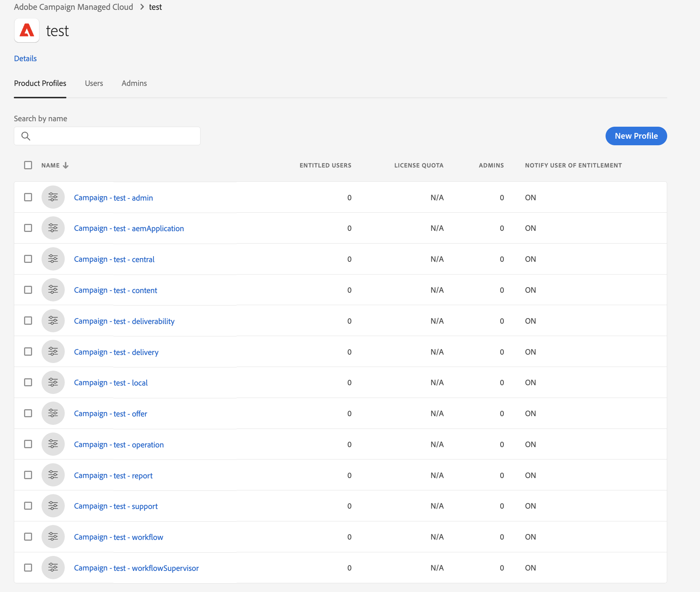

# 管理使用者權限{#manage-permissions}

## 新增使用者 {#add-users}

作為產品管理員，您可以新增使用者並授與Campaign的存取權。

若要新增使用者，請遵循下列步驟：

1. 在[Admin Console](https://adminconsole.adobe.com/enterprise){target="_blank"}首頁中，選取&#x200B;**新增使用者**。

   

1. 輸入使用者的電子郵件地址。
1. 使用「+」符號選取要指派給使用者的產品設定檔或使用者群組。

   

   [此區段](#ootb-productprofiles)中列出了Campaign內建的產品設定檔。

   在[本節](#user-groups)中瞭解如何建立使用者群組

1. 按一下&#x200B;**儲存**。 會新增使用者，並顯示在使用者清單中。 如果您將管理員角色或產品設定檔指派給使用者，使用者會收到電子郵件通知。 使用者必須按照連結完成他們的設定檔。

在[此頁面](https://helpx.adobe.com/ie/enterprise/using/manage-users-individually.html){target="_blank"}中進一步瞭解在Admin Console中建立使用者。

當新使用者[使用其Adobe ID登入Campaign](connect.md)時，他們就會新增到使用者端主控台的Campaign運運算元清單中。 行銷活動運運算元儲存在Campaign檔案總管的&#x200B;**[!UICONTROL Administration > Access management > Operators]**&#x200B;資料夾中。

## 使用產品設定檔{#product-profiles}

使用產品設定檔讓使用者有權使用產品中包含的功能。

* 對於Admin Console上的每個產品，您可以建立一或多個產品設定檔。
* 在每個產品設定檔中，您都會指派使用者和使用者群組（在您的組織中）。
* 當使用者使用在產品設定檔中指定的認證登入時，他們將被授予該產品設定檔所依據之產品的應用程式和服務的存取權。

這些產品設定檔與儲存在Campaign檔案總管&#x200B;**[!UICONTROL Administration > Access management > Operator groups]**&#x200B;資料夾中的運運算元群組相符。

在Admin Console中，產品設定檔會使用以下語法：

行銷活動 — `<your instance>` — 操作員群組的內部名稱

例如，對於&#39;test&#39;執行個體中的&#x200B;**傳遞操作員**&#x200B;群組，Admin Console中的產品設定檔為：

行銷活動 — 測試 — 傳遞

您可以使用預設的產品設定檔或建立新的設定檔。

### 建立產品設定檔{#create-product-profile}

若要將產品設定檔新增至Adobe，您必須先在Campaign使用者端主控台中建立該設定檔，然後將其新增至Admin Console。

例如，若要建立「稽核者」產品設定檔，請遵循下列步驟。

#### 在Campaign中建立運運算元群組{#create-op-group}

1. 連線至Campaign，開啟檔案總管，並瀏覽至&#x200B;**[!UICONTROL Administration > Access management > Operator groups]**。
1. 按一下&#x200B;**[!UICONTROL New]**，定義運運算元群組的名稱並設定其內部名稱(&#39;reviewers&#39;)。
   
1. 透過選取已命名的許可權來定義相關許可權。 已命名的許可權在[此區段](#use-named-rights)中有詳細說明
1. 儲存新的運運算元群組。

#### 在Admin Console中建立產品設定檔{#create-profile-in-admin-console}

1. 連線至[Admin Console](https://adminconsole.adobe.com/enterprise){target="_blank"}。
1. 從首頁的&#x200B;**產品與服務**&#x200B;區段，開啟Campaign產品。
1. 按一下「**新增設定檔**」，然後輸入要建立的產品設定檔名稱，語法完全正確，如[此處](#product-profiles)所述。 例如，我們輸入：行銷活動 — `<your-instance-name>` — 稽核者

   

1. 儲存您的變更。

您現在可以將使用者新增至這個新的產品設定檔，如[本節](#add-users)中所述。

最佳實務是將產品設定檔指派給使用者群組。 依使用者管理許可權不是可持續的模式。

### 預設產品設定檔和運運算元群組 {#ootb-productprofiles}

Adobe Campaign隨附內建&#x200B;**產品設定檔**，這些設定檔會在Adobe啟用您的環境時定義。

這些產品設定檔符合行銷活動&#x200B;**操作員群組**。 預設運運算元群組及其[已命名的許可權](#use-named-rights)如下所列：

1. **[!UICONTROL Administrator]** （管理員）

   此群組中的運運算元具有此執行個體的完整存取權。 管理員是可存取使用者介面中最技術部分的使用者。

   此群組包含下列已命名的許可權：

   * **[!UICONTROL ADMINISTRATION]**：執行/建立/編輯/刪除任何物件的權利，例如工作流程、傳遞、指令碼等

1. **[!UICONTROL Delivery operators]** （傳遞）

   此群組中的運運算元負責管理傳送：他們可讓您存取建立和準備傳送所需的主要資源（行銷活動型別、傳送對應、預設範本、個人化區塊等）。

   此群組包含下列已命名的許可權：

   * **[!UICONTROL PREPARE DELIVERIES]**：有權建立、編輯和開始傳遞分析，
   * **[!UICONTROL START DELIVERIES]**：核准先前分析的傳遞的許可權。

1. **[!UICONTROL Campaign managers]** （作業）

   此群組中的操作者可以管理行銷活動：這可讓您存取&#x200B;**[!UICONTROL Campaign]** (選用Adobe Campaign模組)架構中連結至行銷活動的物件（計畫、方案、工作流程、預算等）。

   此群組包含下列已命名的許可權：

   * **[!UICONTROL INSERT FOLDERS]**：將資料夾插入Adobe Campaign樹狀結構的許可權（前提是您擁有相關分支的編輯許可權），
   * **[!UICONTROL WORKFLOW]**：使用工作流程的權利。

   >[!NOTE]
   >
   >此群組不會讓操作者開始傳遞。

1. **[!UICONTROL Content contributors]** （內容）

   此群組中的使用者可以存取&#x200B;**[!UICONTROL Content management]**&#x200B;附加元件內容中的內容資料夾。 此群組未授予任何其他許可權。

1. **[!UICONTROL Access to reports]** （報告）

   此群組已保留給外部操作者，以透過[網頁存取](../start/campaign-ui.md#web-browser)存取傳遞報告。

1. **[!UICONTROL Workflow execution]** （工作流程）

   **[!UICONTROL Workflow execution]**&#x200B;群組可讓您控制目標工作流程的執行與核准：名為許可權的工作流程已對應至此群組的運運算元。 除了資料檔案的存取權之外，工作流程上的所有動作都需要它。 依預設，**[!UICONTROL Workflow execution]**&#x200B;群組對標準目標工作流程檔案和工作流程範本具有唯讀存取權。 此群組中的操作者也擁有擱置核准檔案的讀寫存取權。

1. **[!UICONTROL Workflow supervisors]** (workflowSupervisor)

   此群組中的使用者管理工作流程核准，並接收電子郵件通知，以備與行銷活動工作流程相關的警示時使用。

1. **本機/中央管理** （中央/本機）

   此群組中的使用者可以使用&#x200B;**[!UICONTROL Distributed marketing]**&#x200B;附加元件。

1. **[!UICONTROL Offer managers]** （選件）

   此群組中的運運算元在使用互動附加元件時，可以建立和維護優惠方案。 [了解更多](../interaction/interaction-operators.md)。

   此群組包含下列已命名的許可權：

   * **[!UICONTROL INSERT FOLDERS]**：將資料夾插入Adobe Campaign樹狀結構的許可權（前提是您擁有相關分支的編輯許可權），
   * **[!UICONTROL EDIT FOLDERS]**：變更資料夾屬性的權利，例如內部名稱、標籤、關聯的影像、子資料夾順序等。

   指派給優惠方案管理員的許可權可讓他們執行下列工作：

   * 修改&#x200B;**[!UICONTROL Design]**&#x200B;環境。
   * 檢視&#x200B;**[!UICONTROL Live]**&#x200B;環境。
   * 設定管理功能（預先定義的空格和篩選器）。
   * 建立和更新類別。
   * 建立優惠方案。
   * 設定優惠資格。
   * 核准優惠方案。

   >[!NOTE]
   >
   >**優惠方案管理員**&#x200B;只有在未指定稽核者或已在優惠方案範本中設定為稽核者時，才能核准優惠方案。

   [此頁面](../interaction/interaction-operators.md#recap-of-rights-according-to-operator)提供每個環境的提案管理員許可權矩陣。

## 使用使用者群組{#user-groups}

您可以使用Admin Console來建立使用者群組，並將使用者指派給他們。

使用者群組是必須獲授一組共用許可權的不同使用者的集合。 在[本節](https://helpx.adobe.com/ie/enterprise/using/user-groups.html){target="_blank"}中瞭解如何建立使用者群組。

您可以將產品設定檔指派給使用者群組。 因此，該群組中的所有使用者都會獲得相同的產品許可權集。

## 已命名的權限{#use-named-rights}

Adobe Campaign隨附一組已命名的許可權，可讓您定義指派給使用者和使用者群組的許可權。 這些許可權可以從Campaign檔案總管的&#x200B;**[!UICONTROL Administration > Access management > Named rights]**&#x200B;資料夾進行編輯。

已命名的許可權會將許可權授予：

* 執行作業
例如，已針對具有&#x200B;**準備傳遞**&#x200B;命名許可權的&#x200B;**傳遞操作員**&#x200B;群組的成員，啟用傳遞編輯器中的&#x200B;**分析**&#x200B;按鈕

* 存取資料夾
操作員群組的成員資格可以透過變更資料夾的安全性設定，來授予或限制資料夾的存取權。 [了解更多](folder-permissions.md#restrict-access-to-a-folder)。

  例如，它可以影響： **寫入存取權**&#x200B;以建立新實體（例如傳送、設定檔等）、**讀取存取權**&#x200B;以使用實體、**刪除存取權**&#x200B;以刪除實體。

Adobe Campaign中的預設已命名許可權為：

* **[!UICONTROL ADMINISTRATION]**：具有&#x200B;**[!UICONTROL ADMINISTRATION]**&#x200B;許可權的運運算元具有執行個體的完整存取權。 管理員使用者可以執行/建立/編輯/刪除任何物件，例如工作流程、傳送、指令碼等。

* **[!UICONTROL APPROVAL ADMINISTRATION]**：您可以在工作流程與傳遞中設定多個核准步驟，以確保指派的運運算元或群組已核准目前狀態。 具有&#x200B;**[!UICONTROL APPROVAL ADMINISTRATION]**&#x200B;許可權的使用者可以設定核准步驟，也可以指派應核准這些步驟的運運算元或運運算元群組。

* **[!UICONTROL CENTRAL]**：適用於集中管理（分散式行銷）。

* **[!UICONTROL DELETE FOLDER]**：刪除資料夾的許可權。 透過此許可權，使用者可以從檔案總管檢視中刪除資料夾。

* **[!UICONTROL EDIT FOLDERS]**：變更資料夾屬性的權利，例如內部名稱、標籤、關聯的影像、子資料夾順序等。

* **[!UICONTROL EXPORT]**：使用者可以使用&#x200B;**[!UICONTROL EXPORT]**&#x200B;工作流程活動，將資料從其Adobe Campaign執行個體匯出至伺服器或本機電腦上的檔案。

* **[!UICONTROL FILES ACCESS]**：透過指令碼讀取和寫入檔案的許可權，指令碼可在&#x200B;**[!UICONTROL JavaScript]**&#x200B;工作流程活動中寫入，以讀取/寫入伺服器上的檔案。

* **[!UICONTROL IMPORT]**：一般資料匯入的許可權。 **[!UICONTROL IMPORT]**&#x200B;可讓您將資料匯入任何其他資料表，而&#x200B;**[!UICONTROL RECIPIENT IMPORT]**&#x200B;許可權僅允許匯入收件者資料表。

* **[!UICONTROL INSERT FOLDERS]**：插入資料夾的許可權。 具有&#x200B;**[!UICONTROL INSERT FOLDERS]**&#x200B;許可權的使用者可以在檔案總管檢視的資料夾樹狀結構中建立新資料夾。

* **[!UICONTROL LOCAL]**：直接用於本機管理（分散式行銷）。

* **[!UICONTROL MERGE]**：直接將選取的記錄合併為一個。 如果收件者以重複專案存在，**[!UICONTROL MERGE]**&#x200B;許可權可讓使用者選取重複專案，並將其合併至主要收件者。

* **[!UICONTROL PREPARE DELIVERIES]**：建立、編輯和儲存傳遞的權利。 具有&#x200B;**[!UICONTROL PREPARE DELIVERIES]**&#x200B;許可權的使用者也可以開始傳遞分析程式。

* **[!UICONTROL PRIVACY DATA RIGHT]**：收集和刪除隱私資料的權利。 [了解更多](privacy.md)。

* **[!UICONTROL PROGRAM EXECUTION]**：以各種程式語言執行命令的權利。

* **[!UICONTROL RECIPIENT IMPORT]**：匯入收件者的權利。 具有&#x200B;**[!UICONTROL RECIPIENT IMPORT]**&#x200B;許可權的使用者可以將本機檔案匯入收件者表格。

* **[!UICONTROL SQL SCRIPT EXECUTION]**&#x200B;直接在資料庫上執行任何SQL命令的許可權。

* **[!UICONTROL START DELIVERIES]**：核准先前分析的傳遞的許可權。 傳遞分析後，傳遞會在各種核准步驟暫停，並需要核准才能繼續。 具有&#x200B;**[!UICONTROL START DELIVERIES]**&#x200B;許可權的使用者可核准傳遞。

* **[!UICONTROL USE SQL DATA MANAGEMENT ACTIVITY]**：使用SQL資料管理活動撰寫您自己的SQL指令碼，以建立和填入工作表格。 [了解更多](../../automation/workflow/sql-data-management.md)。

* **[!UICONTROL WORKFLOW]**：此已命名的許可權是工作流程專用：它可讓您建立、啟動和停止工作流程。 已命名許可權必須具備工作流程檔案的讀取許可權才能適用。 若要進行目標工作流程，必須在&#x200B;**[!UICONTROL Profiles and Targets]**&#x200B;資料夾上加上讀取許可權。

* **[!UICONTROL WEBAPP]**：使用Web應用程式的許可權。

>[!NOTE]
>
>此清單可能會因您環境中安裝的附加元件而異。

## 額外資源{#additional-res}

* [管理工作流程的許可權](../../automation/workflow/managing-rights.md)
* [管理分散式行銷的許可權](../../automation/distributed-marketing/about-distributed-marketing.md#operators)
* [管理互動模組的許可權](../interaction/interaction-operators.md)
* [篩選結構描述的存取權](../dev/filter-schema.md)
* [限制 PI 檢視](../dev/restrict-pi-view.md)
