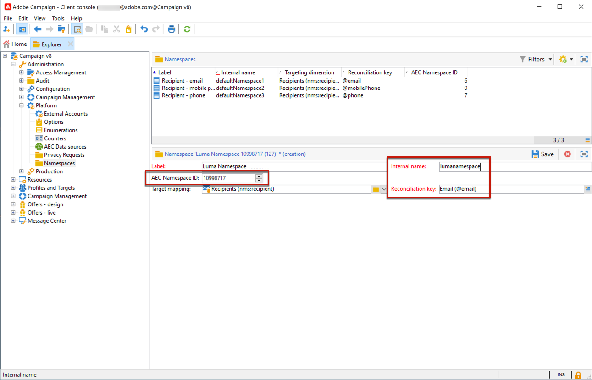

# 管理 Campaign 的隱私權請求 {#privacy}

根據您的業務性質及其營運的管轄區，您的資料作業可能受法律隱私權法規的約束。 這些法規通常授予權利給您的客戶，讓他們可請求存取您自他們那裡收集的資料，以及請求您刪除該筆儲存資料。 客戶對其個人資料的請求，在本文件稱為「隱私權請求」。

Adobe 為資料控制方提供工具，可針對儲存在 Campaign 的資料建立並處理隱私權請求。然而，資料控制方應負責確認提出請求之資料主體身份，並確認傳回給請求者的資料與資料主體有關。若需進一步資訊了解個人資料及管理資料的不同實體，請參考 [Adobe Campaign Classic v7 文件](https://experienceleague.adobe.com/docs/campaign-classic/using/getting-started/privacy/privacy-and-recommendations.html?lang=zh-Hant#personal-data){target="_blank"}。


若要在 Campaign 管理隱私權請求，首先您必須[定義命名空間](#namespaces)。 然後，您就可以建立並管理隱私權請求。 若要執行隱私權請求，請利用 **Adobe Privacy Service** 整合。 從 Privacy Service 推播至所有 Adobe Experience Cloud 解決方案的隱私權請求，會由 Campaign 透過專用工作流程自動處理。[了解更多](#create-privacy-request)

若需了解&#x200B;**存取權限**&#x200B;與&#x200B;**被遺忘的權利** (刪除請求)，請參閱 [Adobe Campaign Classic v7 文件](https://experienceleague.adobe.com/docs/campaign-classic/using/getting-started/privacy/privacy-management.html?lang=zh-Hant#right-access-forgotten){target="_blank"}。


>[!NOTE]
>
>此功能可從 Campaign v8.3 開始使用。若要檢查您的版本，請參閱[此章節](compatibility-matrix.md#how-to-check-your-campaign-version-and-buildversion)

## 定義命名空間 {#namespaces}

在建立隱私權請求之前，您必須&#x200B;**定義命名空間**&#x200B;以利使用。 命名空間是用於識別資料庫中資料主體的金鑰。

>[!NOTE]
>
>深入了解身分命名空間，請參閱 [Adobe Experience Platform 文件](https://experienceleague.adobe.com/docs/experience-platform/identity/namespaces.html?lang=zh-Hant){target="_blank"}。

目前的 Adobe Campaign 不支援從 Experience Platform 身分識別命名空間服務匯入命名空間。 因此，在身分命名空間服務上建立命名空間後，必須在 Adobe Campaign 介面上手動建立對應的命名空間。 請依照下列步驟以執行此操作。

<!--v7?
Three namespaces are available out-of-the-box: email, phone and mobile phone. If you need a different namespace (a recipient custom field, for example), you can create a new one from **[!UICONTROL Administration]** > **[!UICONTROL Platform]** > **[!UICONTROL Namespaces]**.

>[!NOTE]
>
>For optimal performance, it is recommended to use out-of-the-box namespaces.
-->

1. 在[身分命名空間服務](https://developer.adobe.com/experience-platform-apis/references/identity-service/#tag/Identity-Namespace){target="_blank"}上建立命名空間。

1. 當[列出可用於您組織的身分命名空間](https://developer.adobe.com/experience-platform-apis/references/identity-service/#operation/getIdNamespaces){target="_blank"}，您將獲得以下命名空間詳細資訊，例如：

   ```
   {
           "updateTime": 1632903236731,
           "code": "lumanamespace",
           "status": "ACTIVE",
           "description": "new namespace for Luma privacy requests",
           "id": 10998717,
           "createTime": 1632903236731,
           "idType": "Email",
           "namespaceType": "Custom",
           "name": "Luma Namespace",
           "custom": true
   }
   ```

1. 在 Adobe Campaign，瀏覽 **[!UICONTROL Administration]** > **[!UICONTROL Platform]** > **[!UICONTROL Namespaces]** 並選擇 **[!UICONTROL New]**。

   

1. 輸入 **[!UICONTROL Label]**。

1. 填寫新命名空間的詳細資訊，以符合在識別命名空間服務上建立的命名空間：

   * **[!UICONTROL AEC Namespace ID]** 必須與「id」屬性相符
   * **[!UICONTROL Internal name]** 必須與「code」屬性相符
   * **[!UICONTROL Reconciliation key]** 必須與「idType」屬性相符

   

   這是將用於識別 Adobe Campaign 資料庫中資料主體的欄位&#x200B;**[!UICONTROL Reconciliation key]**。

1. 選擇目標對應<!--(**[!UICONTROL Recipients]**, **[!UICONTROL Real time event]** or **[!UICONTROL Subscriptions]**)-->，指定在 Adobe Campaign 中命名空間的協調方式。

   >[!NOTE]
   >
   >如果您需要使用數個目標對應，請為每個目標對應建立一個命名空間。

1. 儲存您的變更。

您現在可以根據新的命名空間來建立隱私權要求。如果使用多個命名空間，請為每個命名空間相同的協調值建立一個隱私權請求。

## 建立隱私權請求 {#create-privacy-request}

**[!DNL Adobe Experience Platform Privacy Service]**&#x200B;整合可讓您透過單一 JSON API 呼叫，在多解決方案內容中自動處理您的隱私權請求。Adobe Campaign 透過專用工作流程自動處理推播來自隱私權服務的請求。

請參閱 [Experience Platform Privacy Service](https://experienceleague.adobe.com/docs/experience-platform/sources/home.html?lang=zh-Hant) 文件，以瞭解如何從隱私權核心服務建立隱私權要求。{target="_blank"}

依據正在使用的命名空間數量，在 Adobe Campaign 中每個 **[!DNL Privacy Service]** 工作都會分割為多個隱私權請求，而一個請求都會與一個命名空間相對應。

此外，一個作業可在多個執行個體上執行。因此，會針對一個作業建立多個檔案。例如，如果要求有兩個命名空間，且在三個執行個體上執行，則總共會傳送六個檔案。每個命名空間和執行個體會有一個檔案。

檔案名稱的模式是：`<InstanceName>-<NamespaceId>-<ReconciliationKey>.xml`

* **InstanceName**：Campaign 執行個體名稱
* **NamespaceId**：所使用命名空間的身份識別服務命名空間 ID
* **調解金鑰**：編碼調解金鑰

>[!CAUTION]
>
>若要使用自訂名稱空間類型提交請求，請利用 [JSON 方法](https://experienceleague.adobe.com/docs/experience-platform/privacy/ui/user-guide.html?lang=zh-Hant#json){target="_blank"} and add the namespaceId to the request, or use the [API call](https://experienceleague.adobe.com/docs/experience-platform/privacy/api/privacy-jobs.html?lang=zh-Hant#access-delete){target="_blank"}提出請求。
>
>僅透過[隱私權使用者介面](https://experienceleague.adobe.com/docs/experience-platform/privacy/ui/user-guide.html?lang=zh-Hant#request-builder){target="_blank"}，利用標準命名空間類型提交請求。

### 處理請求時搜尋的表格 {#list-of-tables}

執行刪除或存取隱私權要求時，Adobe Campaign 會根據所有包含收件者表格連結 (自有類型) 之表格中的&#x200B;**[!UICONTROL Reconciliation value]**，以搜尋所有資料主體的資料。

執行隱私權請求時，考慮的內建表格清單包括：

* 收件者 (recipient)
* 收件者傳遞記錄 (broadLogRcp)
* 收件者追蹤記錄 (trackingLogRcp)
* 封存的事件傳遞記錄 (broadLogEventHisto)
* 收件者清單內容 (rcpGrpRel)
* 訪客優惠方案主張 (propositionVisitor)
* 訪客 (visitor)
* 訂閱歷史記錄 (subHisto)
* 訂閱 (subscription)
* 收件者優惠方案主張 (propositionRcp)

如果您建立的自訂資源具有收件者表格 (自有類型) 的連結，也會將這些帳戶列入考量。例如，如果您有連結至收件者表格的交易表格和連結至交易表格的交易詳細資料，則會同時將這些帳戶列入考量。
<!--
>[!CAUTION]
>
>If you perform Privacy batch requests using profile deletion workflows, please take into consideration the following remarks:
>* Profile deletion via workflows do not process children tables.
>* You need to handle the deletion for all the children tables.
>* Adobe recommends that you create an ETL workflow that add the lines to delete in the Privacy Access table and let the **[!UICONTROL Delete privacy requests data]** workflow perform the deletion. We suggest to limit to 200 profiles per day to delete for performance reasons.-->

### 隱私權請求狀態 {#privacy-request-statuses}

您可在下方找到 Adobe Campaign 隱私權請求的不同狀態以及其意涵：

* **[!UICONTROL New]** / **[!UICONTROL Retry pending]**：進行中，工作流程尚未處理要求。
* **[!UICONTROL Processing]** / **[!UICONTROL Retry in progress]**：工作流程正在處理要求。
* **[!UICONTROL Delete pending]**：工作流程已識別所有要刪除的收件者資料。
* **[!UICONTROL Delete in progress]**：工作流程正在處理刪除。
* **[!UICONTROL Complete]**：要求處理已完成，並未發生錯誤。
* **[!UICONTROL Error]**：工作流程發生錯誤。原因會顯示在 **[!UICONTROL Request status]** 欄的「隱私權要求」清單中。例如，**[!UICONTROL Error data not found]** 表示在資料庫中找不到與資料主體 **[!UICONTROL Reconciliation value]** 相符的收件者資料。

Campaign Classic v7 文件中的&#x200B;**相關主題：**

* [隱私權與同意](https://experienceleague.adobe.com/docs/campaign-classic/using/getting-started/privacy/privacy-and-recommendations.html?lang=zh-Hant){target="_blank"}

* [隱私權管理快速入門](https://experienceleague.adobe.com/docs/campaign-classic/using/getting-started/privacy/privacy-management.html?lang=zh-Hant){target="_blank"}

* [隱私權管理法規](https://experienceleague.adobe.com/docs/campaign-classic/using/getting-started/privacy/privacy-management.html?lang=zh-Hant#privacy-management-regulations){target="_blank"} (GDPR、CCPA、PDPA 和 LGPD)

* [選擇退出個人資訊銷售](https://experienceleague.adobe.com/docs/campaign-classic/using/getting-started/privacy/privacy-requests/privacy-requests-ccpa.html?lang=zh-Hant){target="_blank"} (特定於 CCPA)
