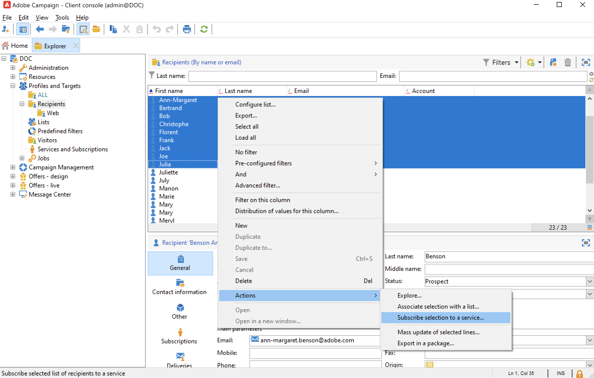
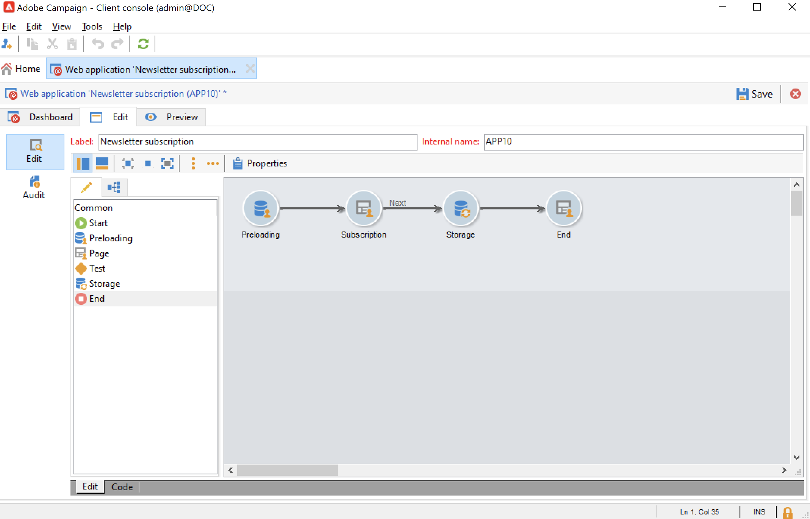

# 管理訂閱和取消訂閱{#optin-optout}

使用Adobe Campaign建立和監視新聞通訊等資訊服務，並管理對這些服務的訂閱/取消訂閱。 可以並行定義多個服務，例如：特定產品類別、網站主題或區域的專業通訊、各種類型的警報消息的訂閱和即時通知。 請參閱管理訂閱。

 瞭解如何建立資訊服務、發送新聞稿以及管理選擇加入和選擇退出 [Campaign Classicv7文檔](https://experienceleague.adobe.com/docs/campaign-classic/using/sending-messages/subscriptions-and-referrals/managing-subscriptions.html){target=&quot;_blank&quot;

要預訂（選擇）服務的配置檔案，可用選項包括：

* 手動將服務添加到收件人配置檔案：來做這個， **[!UICONTROL Subscriptions]** 頁籤，按一下 **[!UICONTROL Add]** 選擇相關資訊服務。

   

    瞭解詳情 [Campaign Classicv7文檔](https://experienceleague.adobe.com/docs/campaign-classic/using/getting-started/profile-management/editing-a-profile.html?lang=en#deliveries-tab){target=&quot;_blank&quot;

* 自動將一組收件人訂閱到服務。 收件人清單可以來自篩選操作、組、資料夾、導入或直接手動選擇。 要訂閱這些收件人，請選擇配置檔案並按一下右鍵。 選取 **[!UICONTROL Actions > Subscribe selection to a service...]**。

   

   選擇相關服務，然後啟動該操作。

   

    瞭解詳情 [Campaign Classicv7文檔](https://experienceleague.adobe.com/docs/campaign-classic/using/getting-started/profile-management/editing-a-profile.html?lang=en#deliveries-tab){target=&quot;_blank&quot;

* 導入收件人並自動將其訂閱到資訊服務。 為此，請在導入嚮導的最後一步中選擇相關服務。

    瞭解詳情 [Campaign Classicv7文檔](https://experienceleague.adobe.com/docs/campaign-classic/using/getting-started/importing-and-exporting-data/generic-imports-exports/executing-import-jobs.html?lang=en#step-5---additional-step-when-importing-recipients){target=&quot;_blank&quot;

* 使用Web表單，以便收件人可以訂閱服務。

   

   市場活動附帶了一個預設的Web表單來管理選擇加入。 您可以個性化它並映射配置檔案資料。

   

    瞭解詳情 [Campaign Classicv7文檔](https://experienceleague.adobe.com/docs/campaign-classic/using/designing-content/web-forms/use-cases--web-forms.html?lang=en#create-a-subscription--form-with-double-opt-in){target=&quot;_blank&quot;

* 建立目標工作流並使用 **[!UICONTROL Subscription service]** 的子菜單。

   

    瞭解詳情 [Campaign Classicv7文檔](https://experienceleague.adobe.com/docs/campaign-classic/using/automating-with-workflows/targeting-activities/subscription-services.html?lang=en#example--subscribe-a-list-of-recipients-to-a-newsletter){target=&quot;_blank&quot;

要取消訂閱（選擇退出）服務中的配置檔案，可用選項包括：

**手動取消訂閱**

* 個性化取消訂閱連結或Web表單
* 手動刪除資訊服務
* 從特定訂閱服務手動刪除收件人

**自動取消訂閱**

* 指定資訊服務的持續時間限制：有效期過後，收件人將自動取消訂閱。 此期間在服務屬性的「編輯」頁籤中指定。 它以天數表示。
* 為填充設定未訂閱工作流。

 瞭解詳情 [Campaign Classicv7文檔](https://experienceleague.adobe.com/docs/campaign-classic/using/sending-messages/subscriptions-and-referrals/managing-subscriptions.html?lang=en#unsubscribing-a-recipient-from-a-service){target=&quot;_blank&quot;

>[!CAUTION]
>
>在 [企業(FDA)部署](../architecture/enterprise-deployment.md)，訂閱和取消訂閱 **非同步** 進程。 每小時處理選擇加入和選擇退出請求。 [了解更多](../architecture/new-apis.md#sub-apis)

您還可以啟用傳遞收件人將郵件轉發給朋友。 為此，請將相關連結插入到您的交貨中。 然後，您可以跟蹤此共用過程以及訪問相關頁面的次數。

 有關此功能的詳細資訊，請參閱 [Campaign Classicv7文檔](https://experienceleague.adobe.com/docs/campaign-classic/using/sending-messages/subscriptions-and-referrals/viral-and-social-marketing.html?lang=en#viral-marketing--forward-to-a-friend){target=&quot;_blank&quot;
