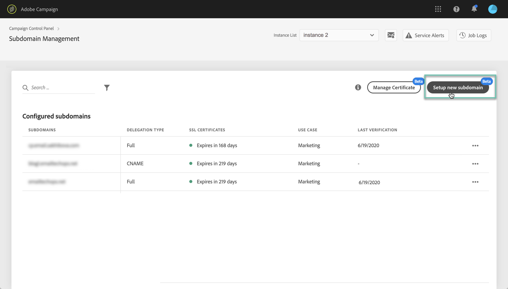

# Adobe Campaign v8 有哪些新功能？ {#ac-gs-what-is-new}

Adobe Campaign v8 專為需要同級最佳雲端解決方案的跨頻道行銷人員而設計，該解決方案適用於具有企業規模的跨頻道行銷活動管理。 它提供強大的 ETL 和資料管理功能，有助於製作和策畫完美的促銷活動。 其編排引擎為豐富的多點觸控行銷方案提供了支援，其核心是批次型處理的驅動歷程。 它還配備了可擴充的即時傳訊伺服器，使行銷團隊能夠基於來自任何 IT 系統的包含所有內容的有效負載來傳送預先定義的訊息，用於諸如重設密碼、訂單確認、電子收據等等。

Adobe Campaign v8 明顯改善基礎架構、安全性、可傳遞性和監視功能。 

## 主要功能{#key-capabilities}

主要功能包括：

* **工作流程管理中央區域**。 提升行銷活動各方面的速度和規模，從建立細分市場和傳遞準備訊息。

   Adobe Campaign 透過單一、易用的促銷活動編程介面，讓您輕鬆達成頻道同步。 因此，您的線上頻道 — 如電子郵件、網路、行動裝置和社交 — 與您的離線頻道相匹配，包括直接郵件、呼叫中心、商店裡等。 它使您能夠在數字和傳統頻道中為客戶提供一致的內容體驗。  Adobe Campaign 讓您可以透過任何通路將內容傳送到客戶可能選擇的所有路徑。

   [進一步瞭解行銷活動工作流程](../config/workflows.md)

* **個人化電子郵件行銷**。 建立與客戶其他體驗相一致的個人化和內容相關的電子郵件。

   Adobe Campaign 讓您的電子郵件更好、更個人化、更具經濟效益。 電子郵件建立簡單且傳送容易。 Campaign v8 讓您能夠靈活設計、個人化、測試、完善並改進您傳送的每封郵件。

    [進一步瞭解個人化功能](create-message.md)

* **客戶資料管理**。 全方位了解您的客戶，以便快速建立企業規模的個人化行銷活動。

   Adobe Campaign 協助您以所有頻道收集的資料為基礎，組建客戶個人檔案。透過個人檔案，您可以跨頻道協調行銷活動。 透過連接所有行銷頻道，您可以為客戶量身打造不同的歷程，讓每位客戶採用符合其需求的方式進行。

    [進一步了解客戶資料管理](audiences.md)

* **同類最佳的促銷活動管理**。 Adobe Campaign v8 為行銷人員提供同類最佳功能，協助您規劃、發佈並評估跨頻道行銷活動。

   功能包括提供客戶的整合個人檔案，透過單一檢視了解客戶。 大規模建立行銷活動受眾的資料管理及細分。 針對自動化多頻道與多波次行銷活動的跨頻道工作流程管理。 整合電子郵件，減少對高成本 ESP 的依賴。 提供報告及分析，以了解客戶行為與行銷活動績效。

    [進一步瞭解行銷活動管理](campaigns.md)

* **連線到 Adobe Experience Platform**。Adobe Campaign v8 透過 Real-Time CDP 與 Adobe Experience Platform 支援資料連接器，讓機構可以利用即時且統一的客戶個人檔案。

   此外，Adobe Campaign v8 與即時行程協調功能可自然整合，因此行銷人員可以重複使用 Adobe Campaign 的相同範本與傳送功能，以便與客戶即時接觸。 這些投資將最佳化 Adobe Campaign 的客戶體驗，並解鎖新的使用案例，例如新增個人化即時客戶歷程至行銷活動等功能。

   您也可以使用 Journey AI 設定預測性傳送時間最佳化和預測性參與度評分，並提高開放率、點擊次數和收入。

    [進一步瞭解 Campaign 整合](../connect/integration.md)

* **Managed Cloud Services**。Adobe Campaign v8 可作為 Managed Cloud Services，提供主動預防性監督、即時警報及服務管理。

   Adobe Managed Cloud Service 為行銷人員提供了更靈活、安全性更高、可擴充性也更大的跨頻道行銷管理解決方案，而且總體擁有成本低廉。 新產品結合了服務與主動性監督和及時警報。

* **速度和規模**。Adobe Campaign 現在可以利用雲端規模的資料庫技術，大幅提高規模與速度。

   [Campaign v8 企業版](../architecture/enterprise-deployment.md) 帶來 **完全同盟資料存取** (FFDA) 的概念：所有資料現在都在雲端資料庫遠端處理。透過新產品，Campaign v8 可簡化資料管理：雲端資料庫無需索引。 您只需要建立表格、複製資料，即可開始。[!DNL Snowflake] 是 Campaign Cloud 資料庫，可為您帶來速度和耐力：系統活動峰值不會過載。雲端資料庫技術不需要進行具體的維護來保證效能等級。

    [進一步了解企業 (FFDA) 部署](../architecture/enterprise-deployment.md)

>[!CAUTION]
>
>* Campaign v8 目前&#x200B;**僅** 以 Managed Cloud Service 的形式提供，不適用於內部部署或混合式環境。 
>
>* 無法從現有 Campaign Classic V7 環境進行自動移轉。

## 自助服務管理介面{#self-service-admin}

作為產品管理員，您可以利用 **Campaign 控制面板**&#x200B;來管理設定並追蹤每個 Campaign v8 執行個體的使用情況。

透過直觀的使用者介面，管理員可以監視重要資產的使用情況，執行進階任務，例如 IP 位址允許清單、SFTP 儲存監視、金鑰管理等等。 此自助服務介面為您帶來更多彈性，並幫助您：

* 自行快速變更設定，而無需聯絡 Adobe 支援部門。
* 根據不同時間的不同業務需求進行設定
* 根據需求控制存取設定，以加強安全性

 [瞭解有關市場活動控制面板的詳細資訊](https://experienceleague.adobe.com/docs/control-panel/using/discover-control-panel/key-features.html?lang=zh-Hant){target="_blank"}

